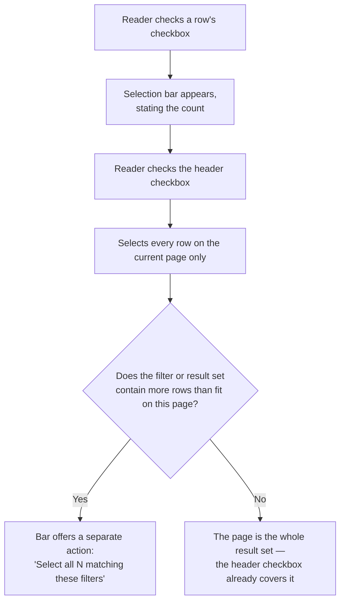

## The problem

A reader looking at a table of a hundred campaigns doesn't want to delete, export, or tag them
one at a time. They want to check the ones they mean and act on all of them at once. Without a
deliberate pattern for this, every team either repeats a row of action buttons on every row —
expensive to scan and expensive to click fifty times — or bolts a bespoke selection model onto
whichever table needed it first.

Selection is also where ambiguity becomes expensive. "Select all" over a table sitting behind an
active filter has at least three plausible meanings: every row on the current page, every row
matching the filter, or every row that exists. Get the scope wrong on an export and the reader
gets a stale file. Get it wrong on a delete and the reader loses data that was never on screen.

This pattern is not the checkbox. **The pattern is the bar that appears once something is
selected, and the rule for what "select all" is allowed to mean.**

## Deciding what select-all means



<Tip>
  **The header checkbox never silently means more than the page.** Titan's own design library
  already answers this — a menu on the header checkbox with **Select all *n* items**, **Select
  all on page**, and **Deselect all** — see
  [TITAN-DIV-19](/invoca-design-system/foundations/divergences#titan-div-19). None of it exists
  in code yet; this pattern is that menu's specification, not a competing proposal. Where the
  question feels genuinely open, it is only the implementation that's undecided — the scope
  distinction itself is design intent already recorded.
</Tip>

## Vocabulary

| Term | Also called | The system uses |
|---|---|---|
| Select all | Select everything, check all | Ambiguous on its own — this page always qualifies it: **select all on page**, or **select all N matching** |
| Selection bar | Bulk action bar, toolbar | **Selection bar** — appears once anything is selected; states the count and scope, holds the bulk actions |
| Scope | Selection scope | **Scope** — which rows a selection actually covers: the current page, or every row matching the active filter |

## When this applies

- A reader needs to act on more than one row at a time, on the same data type, with the same
  action.
- The table or list is long enough that per-row controls would need to be pressed repeatedly to
  get the same result.
- The action — export, tag, archive, delete — makes sense applied to a batch, not only to one
  record.

## When it doesn't

| Situation | Do this instead | Why |
|---|---|---|
| Acting on exactly one row, most of the time | A [row action](/invoca-design-system/components/data-display/table#composition) in a trailing column | Selection mode is overhead for a task that is usually singular. |
| The action needs its own confirmation per item, with different consequences each time | Handle each confirmation individually, not as a batch | Bulk selection assumes one action applies uniformly; per-item review defeats the batching. |
| The list is short enough to see and click every item without scrolling | Nothing — repeat the row action | The pattern earns its cost on a list a reader can't act on one row at a time without real friction. |
| The reader needs to narrow the list before acting, not act on all of it | [Filtering & search](/invoca-design-system/patterns/filtering-and-search) | Selection is what happens after narrowing, not instead of it. |

## Structure

| Order | Component | Role |
|---|---|---|
| 1 | [Checkbox](/invoca-design-system/components/forms/checkbox) — row | Enters that row into the selection. Independent per row. |
| 2 | [Checkbox](/invoca-design-system/components/forms/checkbox) — header / select-all | Selects every row on the current page. Never implicitly more — see [TITAN-BULK-03](#constraints). |
| 3 | [Table](/invoca-design-system/components/data-display/table) or [List](/invoca-design-system/components/data-display/list) | The container being selected from. |
| 4 | Selection bar *(composed — no export)* | Replaces or sits above the table's toolbar once anything is selected. States the count and scope, holds the bulk actions. Built from [Button](/invoca-design-system/components/actions/button) and, for scope, a text line — see [TITAN-DIV-19](/invoca-design-system/foundations/divergences#titan-div-19). |
| 5 | [Button](/invoca-design-system/components/actions/button) — bulk action | Triggers the batch action. Label states the count: "Delete 4 Campaigns." |
| 6 | [Destructive confirmation](/invoca-design-system/patterns/destructive-confirmation) | **Destructive bulk actions only** — the batch's bulk-destructive variation. |

```
┌─────────────────────────────────────────────┐
│ ☑ 4 campaigns selected     [Export] [Delete] │  ← selection bar
├─────────────────────────────────────────────┤
│ ☑  Campaign          Status      Calls       │  ← header checkbox: page only
│ ☑  Q3 Paid Search    Active      1,284       │
│ ☑  Q3 Display        Active        402       │
│ ☑  Holiday Promo     Paused        118       │
│ ☑  Retargeting       Active        310       │
│ ☐  Brand Search      Active        892       │
└─────────────────────────────────────────────┘
```

## Behavior

| State | Behavior |
|---|---|
| First row checked | Selection bar appears, stating the count and scope. Nothing else on the page moves. |
| Header checkbox checked | Selects every row on the current page — no more. If more rows match the active filter, the bar offers "Select all *N* matching" as a distinct, separately-triggered action. |
| Selection partial | Header checkbox reflects the page's state only. There is no way to show "some selected" on the checkbox itself — see [TITAN-GAP-33](/invoca-design-system/foundations/open-decisions#titan-gap-33). The bar's count is the only signal that a subset, not everything, is selected. |
| Filter, sort, or search changes | Selection clears. The set the reader selected was scoped to the rows they could see; carrying it across a changed result set silently redefines what "selected" refers to. |
| Navigating away and back | Selection does not persist. |
| Bulk action triggered | The action button enters `loading`, holding its width. The bar stays visible. |
| Bulk action succeeds, in full | Bar closes, selection clears, [Toast](/invoca-design-system/components/feedback/toast) confirms the count and action. |
| Bulk action partially fails | Selection does not clear on the rows that failed. Rows that succeeded drop out of the selection; failed rows stay selected so the reader can retry just those. An [Alert](/invoca-design-system/components/feedback/alert) states the split: "18 of 20 campaigns updated. 2 failed." |
| Bulk action is destructive | Routes through [Destructive confirmation](/invoca-design-system/patterns/destructive-confirmation)'s bulk-destructive variation before running at all — see [TITAN-BULK-07](#constraints). |

## Constraints

| ID | Constraint | Rationale |
|---|---|---|
| **TITAN-BULK-01** | Selecting the first row is what puts the page into selection mode. There is no separate "enter selection mode" control. | A mode the reader has to switch into deliberately is one extra step for the common case, which is checking a box because you want to act on that row. |
| **TITAN-BULK-02** | A bulk action states its count and scope before it runs. | See [TITAN-TBL-08](/invoca-design-system/components/data-display/table#constraints) — do not restate its reasoning, follow it. |
| **TITAN-BULK-03** | The header checkbox selects the current page only. Selecting every row matching a filter is a separate, explicitly-labeled action. | "Select all" over a filtered table is ambiguous between the page, the filter, and everything — see [TITAN-DIV-19](/invoca-design-system/foundations/divergences#titan-div-19). |
| **TITAN-BULK-04** | The select-all checkbox shows checked only when every row on the page is selected. A partial selection is signaled by the bar's count, never by the checkbox. | No indeterminate state exists — [TITAN-GAP-33](/invoca-design-system/foundations/open-decisions#titan-gap-33). Showing "checked" for a partial selection would misrepresent it; the checkbox has no way to say "some." |
| **TITAN-BULK-05** | Selected-row feedback does not rely on fill color alone. | `background-hover` and `background-selected` are the same value — [TITAN-GAP-04](/invoca-design-system/foundations/open-decisions#titan-gap-04) — so color cannot be the only carrier of selection state; see [TITAN-COLOR-03](/invoca-design-system/foundations/color#constraints). The checkbox's own checked state and the bar's count are what actually carry it. |
| **TITAN-BULK-06** | Selection clears when the filter, sort, or search that produced the current result set changes. | The selection was scoped to a specific set of visible rows. Carrying it forward silently applies it to a different set the reader never looked at. |
| **TITAN-BULK-07** | A destructive bulk action is confirmed once, for the batch, via [Destructive confirmation](/invoca-design-system/patterns/destructive-confirmation)'s bulk-destructive variation — never once per row. | Per-item confirmation on a routine batch action is exactly the friction that trains users to click through dialogs — see that page's [When it doesn't](/invoca-design-system/patterns/destructive-confirmation#when-it-doesnt) table. |
| **TITAN-BULK-08** | On partial failure, rows that failed stay selected; rows that succeeded do not. The result states both counts. | The reader's next likely action is retrying only the failures. Clearing the whole selection makes them reselect by hand; leaving succeeded rows selected invites re-running an action that already worked. |
| **TITAN-BULK-09** | Every selection checkbox — row and header — carries an accessible name identifying its scope. | See [TITAN-CHK-02](/invoca-design-system/components/forms/checkbox#constraints) and [TITAN-CHK-05](/invoca-design-system/components/forms/checkbox#constraints) — a column of controls all announcing "checkbox" is unusable, and a group needs a name distinct from any one option's. |

## Content

| Element | ✅ | ❌ |
|---|---|---|
| Bar count | 4 campaigns selected | 4 items selected |
| Select-all beyond the page | Select all 128 campaigns matching these filters | Select all |
| Bulk action button | Delete 4 Campaigns | Delete |
| Partial failure | 18 of 20 campaigns updated. 2 failed. | Some updates failed. |

## Accessibility

- The selection count is a live region, announced politely on change. A keyboard user checking
  rows gets no other confirmation that anything happened — see
  [Table's own accessibility section](/invoca-design-system/components/data-display/table#accessibility).
- The bar appearing does not steal focus. Focus stays on the checkbox the reader just pressed.
- Each row checkbox's accessible name identifies the row: "Select row: Q3 Paid Search," not
  "Checkbox" — see [TITAN-CHK-02](/invoca-design-system/components/forms/checkbox#constraints).
- The header checkbox's accessible name states its scope explicitly — "Select all on this
  page" — rather than the generic "Select all," since what it selects is exactly the fact this
  pattern has to disambiguate.
- Bulk action buttons are reachable in the same tab order as the rest of the toolbar; the bar
  does not trap focus.

## Variations

| Variation | When | Change |
|---|---|---|
| Selection in a List, not a Table | No columns, no header row | [List](/invoca-design-system/components/data-display/list) has no header checkbox to compose a select-all menu onto — state scope in the bar's copy alone, since there is no control to carry it. |
| Bulk destructive action | The action deletes or otherwise destroys | Route through [Destructive confirmation](/invoca-design-system/patterns/destructive-confirmation)'s bulk-destructive variation. Title states the count; body names the highest-consequence item. |
| Selecting a very large matching set (thousands of rows) | "Select all matching" spans more than a page or two of results | State that the action may take time, and consider running it as a tracked background job rather than blocking the bar on a synchronous batch. |

## Anti-patterns

**Per-row action buttons repeated down every row.** Cheap to build, expensive for anyone who
has to click the same button fifty times to do one job. This is the exact case this pattern
exists to replace.

**A "select all" that quietly means everything, including rows never shown.** A reader who
checked a header box expecting "this page" and got "every campaign in the account" has just
run a bulk action on data they never saw. Scope has to be explicit, especially for anything
destructive.

**Selection that survives a filter change unannounced.** A reader who filtered to "Active,"
selected four rows, then cleared the filter still has four rows selected — rows that may no
longer even be visible. Acting on that selection now applies to a set the reader can't see and
didn't choose in this view.

**Treating a partial bulk failure as a full success or a full failure.** Clearing the whole
selection because most of it worked hides the two rows that didn't; failing the whole batch
because two rows errored discards eighteen that succeeded. Either one makes the reader redo
work that already happened correctly.

## Known issues

| ID | Kind | What |
|---|---|---|
| [TITAN-DIV-19](/invoca-design-system/foundations/divergences#titan-div-19) | Divergence | The design library specifies a header-checkbox menu with "Select all *n* items," "Select all on page," and "Deselect all" — none of it exists in code. This pattern is that menu's specification, per [TITAN-BULK-03](#constraints), not a competing proposal. |
| [TITAN-GAP-33](/invoca-design-system/foundations/open-decisions#titan-gap-33) | Open decision | No indeterminate/mixed checkbox state exists in the design library, so [TITAN-BULK-04](#constraints) settles for the bar's count as the only signal of a partial selection. |
| [TITAN-DIV-20](/invoca-design-system/foundations/divergences#titan-div-20) / [TITAN-GAP-04](/invoca-design-system/foundations/open-decisions#titan-gap-04) | Divergence / Open decision | `background-hover` and `background-selected` resolve to the same value — a hovered row and a selected row currently look identical, which is why [TITAN-BULK-05](#constraints) doesn't rely on fill color to carry selection state. |

## Gaps in the current rules

- What "select all N matching" should do if N is large enough that running the action
  synchronously would time out — [Variations](#variations) gestures at a background job without
  naming a threshold.
- Whether a retry after a partial failure should re-fetch the rows first, in case they changed
  between the first attempt and the retry.
- Whether selection should ever persist across a page reload within the same session, rather
  than clearing unconditionally.

## Why it works this way

**The header checkbox is scoped to the page, never to everything, because "select all" over a
filtered table has no single obvious meaning.** [TITAN-BULK-03](#constraints) resolves the
ambiguity by making the larger scope a separate, explicitly-labeled action rather than an
implicit consequence of the same click — a reader who wanted the page gets the page, and a
reader who wanted everything has to say so.

**Selection clears on any change to the underlying result set because a selection is a claim
about specific rows, not a count.** [TITAN-BULK-06](#constraints) treats a changed filter as a
changed context entirely — carrying four selected rows across a filter change silently
redefines what "those four" refers to, and the reader never agreed to that redefinition.

## Related

[Table](/invoca-design-system/components/data-display/table) and
[List](/invoca-design-system/components/data-display/list), the two containers this pattern
selects from. [Checkbox](/invoca-design-system/components/forms/checkbox), the row and header
controls. [Destructive confirmation](/invoca-design-system/patterns/destructive-confirmation),
for the bulk-destructive variation a destructive batch action routes through.
[Filtering & search](/invoca-design-system/patterns/filtering-and-search), for the narrowing
that precedes selection and clears it on change.

## Status

**Exemplar page — first pass.** This is a *proposal* for review, not established policy. No
Titan design-library review or shipped Invoca screen backs this page — it is built from
general interaction-design practice and from constraints [Table](/invoca-design-system/components/data-display/table),
[List](/invoca-design-system/components/data-display/list), and
[Checkbox](/invoca-design-system/components/forms/checkbox) already establish. Two of those
constraints are real, current limits on what this pattern can promise, not workarounds this
page invents around them:

- **[TITAN-GAP-04](/invoca-design-system/foundations/open-decisions#titan-gap-04)** —
  `background-hover` and `background-selected` resolve to the identical color today. A
  hovered row and a selected row look the same, so this pattern cannot rely on fill color to
  show selection (see [TITAN-DIV-20](/invoca-design-system/foundations/divergences#titan-div-20)).
- **[TITAN-GAP-33](/invoca-design-system/foundations/open-decisions#titan-gap-33)** — no
  indeterminate/mixed checkbox state exists in the design library. A select-all checkbox has
  no way to show "some, but not all." This page does not invent one.
