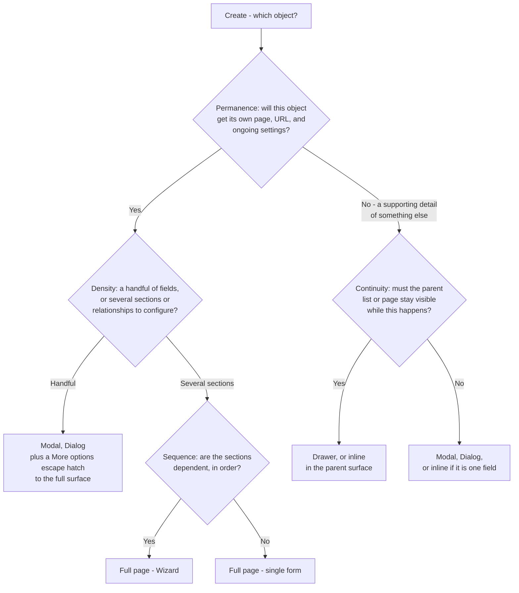

<Warning>
  **Exemplar page — first pass.** This is a proposal for review, not established policy — see
  [CRUD overview](/invoca-design-system/patterns/crud/overview#coverage-stated-honestly). This
  page decides **which** surface an object's creation belongs on. What
  [Full-page form](/invoca-design-system/views/full-page-form) and
  [Wizard](/invoca-design-system/views/wizard) contain once you're there is that pair's own
  decision, not this page's — see those pages directly.
</Warning>

## The problem

"Add a new one" covers everything from typing a label and hitting enter to configuring a
multi-section object with relationships, validation, and its own reporting once it exists. A
platform that answers "how do I create something" with one fixed surface is wrong at both
ends: a full-page form for a tag is ceremony nobody asked for, and a two-field modal for a
campaign starves an object that's about to have a long life in the product of the room it
needs.

Invoca's own product spans that whole range already — a Tag, a saved filter, a Campaign, an
integration's setup — and each one has creation needs shaped by what kind of object it is, not
by whichever surface a given team reached for first. **This page is the tree that decides the
surface.** Layout inside that surface is a separate, later decision.

## Choosing a surface

Walk the same four axes [CRUD overview](/invoca-design-system/patterns/crud/overview#vocabulary)
defines, in order. Each is answered about the object being created, not the feature building
it.



<Steps>
  <Step title="Permanence — does it outlive this moment?">
    A **Tag** is created, gets used, and never has a page of its own — it's a supporting detail
    of whatever it's attached to. A **Campaign** is created once and then lived in: it gets its
    own reporting, its own settings, its own URL, for months. That difference alone moves the
    floor from "modal" to "full page" before density is even asked.
  </Step>
  <Step title="Density — how much has to be true before it's valid?">
    A saved filter might need a name and the filter state that's already selected — a handful
    of fields, even though it's reasonably permanent. That's the case for a **Modal with an
    escape hatch**: default to the fast path, and hand off to the full surface — never
    discarding what's already been entered — the moment someone needs more than the modal
    offers. See [TITAN-CREATE-04](#constraints).
  </Step>
  <Step title="Continuity — does losing the parent cost more than the interruption saves?">
    Creating a Tag *while filling out a Campaign form* is the case for a **Drawer** or an
    **inline** control: covering the campaign form to go create a tag is a worse interruption
    than the tag creation itself. Titan's own [Dialog](/invoca-design-system/components/containment/dialog)
    and [Drawer](/invoca-design-system/components/containment/drawer) pages already state this
    exact split — Dialog's "choose something else when" table names Drawer for precisely this
    case, and Drawer's own page states the same thing from the other side. This page is citing
    that answer, not deciding a new one.
  </Step>
  <Step title="Sequence — does order matter, and is there enough of it to show?">
    Setting up a new integration might require a connection step before a mapping step before a
    review step, each depending on the last. That's **Full page — Wizard**, with a step
    indicator — see [TITAN-GAP-26](/invoca-design-system/foundations/open-decisions#titan-gap-26).
    A single-section object never reaches this branch at all.
  </Step>
</Steps>

<Note>
  **"Modal" is this page's word for what Titan's design language calls Dialog.** Two of the
  three names in play point at the same thing; the third is a trap. "Modal" (this page) and
  "Dialog" (the design term, and the docs page this page links to) both mean the styled,
  themed surface — imported from the package as `Modal`, per
  [TITAN-DIALOG-01](/invoca-design-system/components/containment/dialog#constraints). The
  package **also** exports something literally named `Dialog` — a raw, unstyled primitive with
  none of `Modal`'s sizing presets, footer contract, or divider tokens. That export is not a
  fourth name for the same thing; it's a different component that happens to share a word with
  the design term. See [TITAN-DIV-27](/invoca-design-system/foundations/divergences#titan-div-27)
  for the full case. Every link on this page to "Dialog" goes to the design-language page, and
  every actual import belongs on `Modal` — never on the package's raw `Dialog` export.
</Note>

## When this applies

- A new object is being added to the product, by a person, as a deliberate action.
- The object has at least one required field or choice — if there's nothing to configure,
  there's nothing to decide a surface for.

## When it doesn't

| Situation | Do this instead | Why |
|---|---|---|
| The object is being duplicated from an existing one, not built from nothing | A "Duplicate" action that pre-fills the same surface Create uses, landing on [Update](/invoca-design-system/patterns/crud/update)'s territory | The surface decision is unchanged; what's different is the form arriving pre-filled, which is Update's concern. |
| The system is creating the object automatically, with no user-authored fields | No surface at all — show the result via [Read](/invoca-design-system/patterns/crud/read) once it exists | A surface implies something to author. Nothing here is being authored. |
| The "create" is really select-one-from-existing | [Select](/invoca-design-system/components/forms/select) or a picker [Dialog](/invoca-design-system/components/containment/dialog), not a creation surface | Choosing an existing object is a different operation than making a new one, even when the UI trigger looks similar ("Add a member" can mean either). |

## Structure

| Order | Component | Role |
|---|---|---|
| 1 | The trigger — [Button](/invoca-design-system/components/actions/button) `outlined`, or `text` if it's a secondary "add another" | Opens the chosen surface. Never `contained` unless creation is the page's single primary action — see [TITAN-BTN-01](/invoca-design-system/components/actions/button#constraints). |
| 2 | The surface — [Dialog](/invoca-design-system/components/containment/dialog), [Drawer](/invoca-design-system/components/containment/drawer), [Full-page form](/invoca-design-system/views/full-page-form), or the parent surface itself for inline | Holds the form. Chosen by the tree above. |
| 3 | [Form](/invoca-design-system/components/forms/form), [Input](/invoca-design-system/components/forms/input), [Select](/invoca-design-system/components/forms/select), etc. | The fields, following [Form validation](/invoca-design-system/patterns/form-validation)'s rules regardless of which surface holds them. |
| 4 | [Button](/invoca-design-system/components/actions/button) `contained` — commit, `text` — cancel | Per [TITAN-BTN-01](/invoca-design-system/components/actions/button#constraints) and [TITAN-DESTROY-05](/invoca-design-system/patterns/destructive-confirmation#constraints)'s ordering, cancel comes first. |

```
Modal (handful of fields, no lasting page)          Drawer (continuity with parent matters)
┌───────────────────────────────┐                   ┌──────────────┬──────────────────┐
│  New saved filter              │                   │  Campaigns   │  New tag          │
│                                 │                   │  list        │                   │
│  Name:  [______________]       │                   │  (still      │  Name: [_______]  │
│  ▸ More options                │                   │   visible)   │                   │
│         [ Cancel ]  [ Save ]   │                   │              │  [ Cancel ] [Save] │
└───────────────────────────────┘                   └──────────────┴──────────────────┘

Full page — Wizard (several dependent sections)
┌─────────────────────────────────────────────┐
│  New integration            Step 2 of 4      │
│  ● Connect  ○ Map fields  ○ Test  ○ Review    │
│                                               │
│  [ ...section content... ]                   │
│                                               │
│                    [ Back ]      [ Next ]    │
└─────────────────────────────────────────────┘
```

## Behavior

| State | Behavior |
|---|---|
| Trigger pressed | The chosen surface opens. A Modal or Drawer opens with focus on the first field; a full page navigates, replacing the current URL. |
| Modal's "More options" pressed | The surface transitions to the full page, carrying every value already entered — see [TITAN-CREATE-04](#constraints). Nothing already typed is lost or re-asked. |
| Validation fails on submit | Per [Form validation](/invoca-design-system/patterns/form-validation) — the surface stays open regardless of which one it is. |
| Submit succeeds | Modal or Drawer closes; a [Toast](/invoca-design-system/components/feedback/toast) confirms and, where the object has a detail page, offers a link to it. A full-page create navigates to the new object's page directly — no toast needed, the destination is the confirmation. |
| Closed or navigated away with unsaved input | Follows [Destructive confirmation](/invoca-design-system/patterns/destructive-confirmation)'s existing guidance on unsaved edits — a lightweight warning for anything non-trivially filled in, nothing for an untouched form. |
| A Wizard's step is left incomplete and the user navigates forward | Blocked with an inline message on the incomplete field — see [TITAN-GAP-26](/invoca-design-system/foundations/open-decisions#titan-gap-26) for the step-indicator gap this depends on. |

## Constraints

| ID | Constraint | Rationale |
|---|---|---|
| **TITAN-CREATE-01** | The surface is chosen by walking Permanence, then Density, then Continuity, then Sequence — in that order — not by which surface is fastest to build. | Building order and decision order are different questions; picking a surface because it's cheap to implement is how the same kind of object ends up created three different ways in three parts of the product. |
| **TITAN-CREATE-02** | An object with no page of its own after creation never opens a full-page surface to create it. | A full page implies the object is worth navigating to. An object with nowhere to navigate to afterward contradicts the surface it was created on. |
| **TITAN-CREATE-03** | A Wizard is used only when sections genuinely depend on each other in order. A form with several independent sections is one page with a Table of Contents, not a Wizard. | A Wizard forces linear traversal. Forcing it on independent sections adds clicks with no corresponding benefit — see [TITAN-GAP-26](/invoca-design-system/foundations/open-decisions#titan-gap-26) for the component this depends on either way. |
| **TITAN-CREATE-04** | A Modal's escape hatch to a fuller surface carries forward every value already entered. It never restarts the form. | Per [CRUD overview: TITAN-CRUD-03](/invoca-design-system/patterns/crud/overview#constraints) — discarding entered data to offer more room is a worse experience than not offering the room. |
| **TITAN-CREATE-05** | The commit button's label states what's being created, not a generic verb. "Create Campaign," not "Submit" or "Create." | Matches the reasoning behind [TITAN-DESTROY-04](/invoca-design-system/patterns/destructive-confirmation#constraints) — at the moment of commitment, the button should say what it does without making the reader re-read the form. |
| **TITAN-CREATE-06** | Closing or navigating away from a non-empty, unsubmitted create surface warns before discarding it, per [Destructive confirmation](/invoca-design-system/patterns/destructive-confirmation)'s existing rule for unsaved edits. An empty, untouched surface closes with no warning. | Warning on an untouched form trains the same dismiss-without-reading behavior [TITAN-DESTROY-01](/invoca-design-system/patterns/destructive-confirmation#constraints) already warns against. |
| **TITAN-CREATE-07** | A successful full-page create navigates to the new object; a successful Modal or Drawer create closes and confirms via Toast, offering a link to the object if one exists. | The full page already *is* the destination once creation succeeds — an extra toast on top of an already-changed URL is a redundant confirmation. A Modal or Drawer returns the reader to where they were, so the confirmation and the way back to the new object both have to be explicit. |

## Content

| Element | ✅ | ❌ |
|---|---|---|
| Trigger | New Campaign | Add / Create / + |
| Modal title | New saved filter | Create |
| Commit button | Create Campaign | Submit |
| Escape hatch | More options | Advanced |
| Success (Modal/Drawer) | Tag created. | Success! |

## Accessibility

- Opening a Modal or Drawer moves focus to the surface's first field; closing it — by commit,
  cancel, or Escape — returns focus to the trigger that opened it.
- A full-page create's navigation is announced the way any page navigation is; no additional
  live region is needed beyond what routing already provides.
- The "More options" escape hatch is a real control with an accessible name stating what it
  does — "Show more options," not an icon alone.
- A Wizard's step indicator states the current step and total count in text, not only through
  visual position — "Step 2 of 4," read by assistive technology, not inferred from which dot is
  filled in.

## Variations

| Variation | When | Change |
|---|---|---|
| Create from a template | Starting point isn't blank | Same surface as a plain create; fields arrive pre-filled. This is the one legitimate overlap with [Update](/invoca-design-system/patterns/crud/update) — see that page. |
| Create, then immediately edit more | The quick-create Modal covers the common case but the object needs more configuration right after | Land on the object's own surface (Drawer or full page, per Update) immediately after the Modal's success — don't ask the reader to find their way there separately. |
| Bulk create (import) | Many objects at once, from a file or a paste | Out of scope for this page — a bulk-creation flow is closer to a Wizard than a repeated single Create, and isn't covered here yet; see [Gaps](#gaps). |

## Gaps

- Bulk creation (import) is not covered by this page and has no proposal yet.
- Whether a Drawer or a full page is the default for an object type that's genuinely
  borderline on Permanence (a "saved view" that some teams treat as disposable and others treat
  as a first-class asset) is not resolved — this page names the axes but doesn't adjudicate every
  real object type against them.

## Anti-patterns

**One fixed surface for every "create," regardless of the object.** The failure this whole page
exists to prevent. A tag and a campaign are not the same kind of decision, and treating them as
though they were produces either an over-built tag flow or an under-built campaign one.

**A Modal that discards entered data when the reader needs "more options."** Offering a
shortcut and then punishing the reader for outgrowing it is worse than never offering the
shortcut — see [TITAN-CREATE-04](#constraints).

**A Wizard for sections that don't actually depend on each other.** Forcing linear steps on
independent content is friction with no organizing benefit — the reader can't skip ahead to the
one section they came to fill in.

## Related

[CRUD overview](/invoca-design-system/patterns/crud/overview), for the shared axes and the
compact version of this tree. [Update](/invoca-design-system/patterns/crud/update), for what
changes once the object already has data. [Form validation](/invoca-design-system/patterns/form-validation)
and [Destructive confirmation](/invoca-design-system/patterns/destructive-confirmation), cited
above rather than restated. [Dialog](/invoca-design-system/components/containment/dialog) and
[Drawer](/invoca-design-system/components/containment/drawer), whose own pages already state
the continuity split this page relies on.

## Why it works this way

**The axes are ordered because they're not equally decisive.** Permanence alone rules out or
requires a full page before density is even asked — a first-class object doesn't get demoted
to a modal just because it happens to have few fields on day one, and a supporting detail
doesn't get promoted to a full page just because it happens to have several. Asking Density
first would produce a modal for a sparse campaign and a full page for a tag with unusually many
attributes, which gets the platform's information architecture backwards.

**The escape hatch exists because the two ends of the tree aren't actually separate features.**
A quick-create Modal and a full creation page for the same object type are one decision
expressed at two densities, not two independent flows that happen to create the same kind of
thing. Carrying data forward instead of restarting is what keeps that true in practice and not
just in principle.
