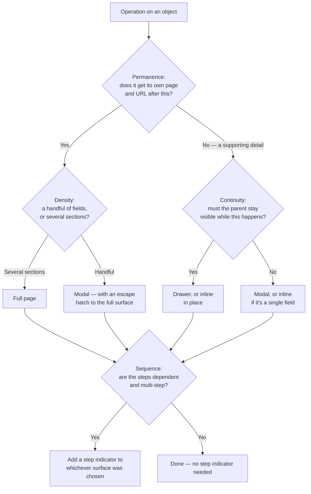

<Warning>
  **Exemplar section — first pass.** Like the rest of [Patterns](/invoca-design-system/patterns/overview),
  this is a proposal for review, not established policy. No audited Invoca screen backs it —
  it is built from general interaction-design practice and from the real components and views
  Titan already ships. See [Coverage, stated honestly](#coverage-stated-honestly).
</Warning>

## What CRUD governs

Every object in the product — a campaign, a tag, a routing rule, a team member — gets created,
read, updated, and deleted somewhere. Those four operations recur so often that it's tempting
to treat "how" as already answered: a form, on a page. It isn't one answer. A tag and a
campaign are both "created," and putting both behind the same full-page form either drowns the
tag in ceremony it doesn't need or starves the campaign of room it does.

**This section's job is the surface decision, not the layout.** It decides whether an
operation happens on a full page, in a drawer, in a modal, or in place — not how that surface
is laid out once chosen. Four sub-pages cover the operations individually; this page holds the
decision framework they share.

<Note>
  **Full page, drawer, modal, and inline are examples, not a fixed menu.** They're the surfaces
  Titan already ships components or views for, so they make the tree concrete. Nothing here
  requires that every operation resolve to one of exactly these four — if a real case needs a
  fifth, that's a gap to raise, not a rule this page is blocking.
</Note>

## Vocabulary

A **surface** is the container an operation happens inside — the thing that has its own
lifecycle (open, dismiss, navigate away) independent of the object being acted on. Four axes
decide which one fits, in the order they're worth asking:

| Axis | Answers | Pulls toward a heavier surface (full page) when… | Pulls toward a lighter one (modal, drawer, inline) when… |
|---|---|---|---|
| **Permanence** | Does the object get a lasting home after this — its own page, URL, ongoing settings? | Yes — it becomes a first-class thing with a life beyond this moment | No — it's a supporting detail of something else and has no page of its own |
| **Density** | How much has to be captured or shown before the object is valid or useful? | Many fields, several sections, or relationships to configure | A handful of fields, one concern |
| **Continuity** | Does the user need to keep seeing or referencing what they came from while acting? | No — the operation deserves full attention with nothing else competing for it | Yes — losing sight of the parent context costs more than the operation is worth |
| **Sequence** | Are the steps dependent on each other in order? | Yes, and there are enough of them to need a visible sequence | No — it's a single atomic step |

**Sequence is a modifier, not a fourth vote.** A "yes" on Sequence doesn't pick a surface by
itself — it says the surface that Permanence, Density, and Continuity already chose needs a
visible step indicator inside it. See [TITAN-GAP-26](/invoca-design-system/foundations/open-decisions#titan-gap-26):
the design library has already drawn what that looks like — a numbered step header paired with
a `Workflow` template — and nothing in code builds it yet. Any sequential surface this section
recommends is a proposal against that same undecided component, not a claim it exists.

## Choosing a surface

This is the shared shape. [Create](/invoca-design-system/patterns/crud/create) walks it in
full depth with real examples and constraints; [Update](/invoca-design-system/patterns/crud/update)
reuses the same tree and covers what's different about acting on an object that already has
data. [Read](/invoca-design-system/patterns/crud/read) answers a narrower version of the same
question, choosing between viewing surfaces Titan already has a View archetype for.

**Delete has no page of its own here.** It is governed almost entirely by
[Destructive confirmation](/invoca-design-system/patterns/destructive-confirmation) already —
that page owns the tier decision, and now owns the CRUD-specific additions (cascades, bulk
delete) too, folded into its own Variations and Constraints. A fourth "Delete" page that mostly
said "see Destructive confirmation" would have been indirection with no real content behind
it; the two are consolidated instead.

## Coverage, stated honestly

| Page | Decided for Invoca? |
|---|---|
| Create | **Proposal** — the fullest treatment; the decision tree above is walked in depth with real component and view mappings |
| Read | **Proposal** — mostly resolves to existing Views ([Detail view](/invoca-design-system/views/detail-view), [List view](/invoca-design-system/views/list-view)) rather than introducing a new decision |
| Update | **Proposal** — reuses Create's tree; the open question is prefill and partial-save behavior, not the surface choice |
| Delete | See [Destructive confirmation](/invoca-design-system/patterns/destructive-confirmation) — no separate CRUD page |

## Choosing where to look

<Columns cols={2}>
  <Card title="Create" icon="circle-plus" href="/invoca-design-system/patterns/crud/create">
    The full decision tree, with real surfaces mapped to real components.
  </Card>
  <Card title="Read" icon="eye" href="/invoca-design-system/patterns/crud/read">
    Viewing an object — full detail page, drawer preview, or inline expansion.
  </Card>
  <Card title="Update" icon="pencil-line" href="/invoca-design-system/patterns/crud/update">
    What changes when the object already has data in it.
  </Card>
  <Card title="Destructive confirmation" icon="trash-2" href="/invoca-design-system/patterns/destructive-confirmation">
    CRUD's Delete operation, in full — including cascades and bulk delete.
  </Card>
</Columns>

## Constraints

| ID | Constraint | Rationale |
|---|---|---|
| **TITAN-CRUD-01** | The surface decision follows the axes in [Choosing a surface](#choosing-a-surface) — Permanence, then Density, then Continuity — not developer convenience or "what the last screen used." | A surface picked because it was quick to build, rather than because the object needed it, is the fastest way to end up with the same object created three different ways in three parts of the product. |
| **TITAN-CRUD-02** | The same object type uses the same surface for Create and Update unless a stated reason distinguishes them. | A campaign created on a full page and edited in a modal asks the user to hold two mental models of the same object. See [Update](/invoca-design-system/patterns/crud/update) for the one legitimate reason this sometimes differs. |
| **TITAN-CRUD-03** | A "quick create" modal that escapes to a full surface hands off the data already entered — it never discards it. | Making someone re-enter what they already typed because they needed one more field is a worse outcome than not offering the shortcut at all. |
| **TITAN-CRUD-04** | A sequential, multi-step operation states which step the user is on and how many remain, regardless of which surface holds it. | Per [TITAN-GAP-26](/invoca-design-system/foundations/open-decisions#titan-gap-26) — a sequence without visible progress is one the user cannot judge whether to start, continue, or abandon. |

## Related

[Views overview](/invoca-design-system/views/overview), for the page frame a full-page
surface is built from. [Destructive confirmation](/invoca-design-system/patterns/destructive-confirmation),
[Bulk selection](/invoca-design-system/patterns/bulk-selection), and
[Inline editing](/invoca-design-system/patterns/inline-editing) — each already answers part
of one CRUD operation and is cited, not re-derived, on the relevant sub-page.

## Why it works this way

**A decision tree, not a fixed rule, is the point.** A rule that says "objects are created on
a full page" is simple and wrong the first time someone needs to create a tag without leaving
the form they were filling out. A rule that says "use whatever fits" is flexible and useless —
it gives the next ten teams ten different answers. The tree is how the platform stays flexible
on the actual axes that matter — how permanent, how dense, how connected to its context an
object is — while still giving the same answer to the same question every time it's asked.

**Read and Delete lean on what already exists because they should.** Writing a second decision
tree for viewing or removing an object, when Views and Destructive confirmation already answer
most of it, would be inventing a distinction that isn't there. Where a CRUD operation is
genuinely a new decision — Create — it gets the full page. Where it mostly isn't, the page says
so and points at the real answer instead of manufacturing a false one.
