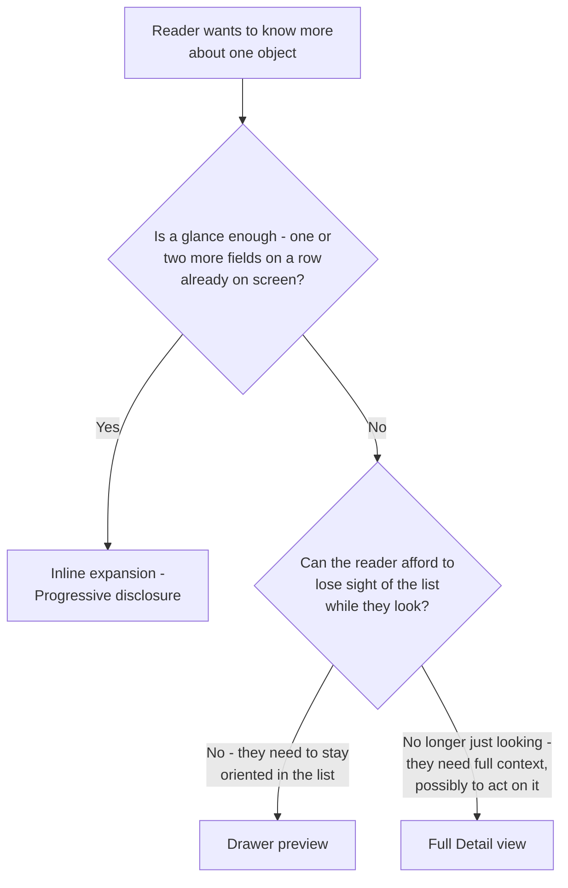

<Warning>
  **Exemplar page — first pass.** This is a proposal for review, not established policy — see
  [CRUD overview](/invoca-design-system/patterns/crud/overview#coverage-stated-honestly). This
  page decides **when** each viewing surface is the right choice; what each one contains once
  the reader is there is that page's own decision — see
  [Detail view](/invoca-design-system/views/detail-view) directly.
</Warning>

## The problem

"Viewing an object" covers two different jobs that get conflated because they both start with
a reader looking at data. Scanning a hundred campaigns to find the one that matters is reading
a **collection** — that job already belongs to [List view](/invoca-design-system/views/list-view),
and this page does not re-cover it. Once the reader knows which object they want and needs to
know more about *that one*, the job changes: now it's how much of it to show, and where.

That second job still isn't one answer. Glancing at one more field on a row already on screen,
previewing an object without losing the list it came from, and needing the object's full
context before acting on it are three different amounts of reading, and three different
surfaces already exist for them.

## Choosing a surface

The same two axes [CRUD overview](/invoca-design-system/patterns/crud/overview#vocabulary)
names — Density and Continuity — decide this from the reader's side rather than the author's:
how much do they need right now, and can they afford to lose sight of the list while getting it.



<Steps>
  <Step title="Inline expansion — one more layer, no surface change">
    A row already shows the object's name and status. Revealing one or two more fields in
    place — without opening anything — is [Progressive disclosure](/invoca-design-system/patterns/progressive-disclosure)'s
    territory exactly. That page already decides the trigger, the default state, and when a
    "show more" control is the right scope. This page is citing that answer, not deriving a
    second one for objects specifically.
  </Step>
  <Step title="Drawer preview — oriented, without leaving">
    The reader wants more than a glance but still needs the list behind them — checking three
    campaigns in a row without losing their place in a filtered table, for instance.
    [Drawer](/invoca-design-system/components/containment/drawer)'s own "Choose Drawer when"
    section already states this exact case: editing, configuring, or reviewing one item while
    the list or page it came from stays visible. A read-only preview is the same reasoning
    applied to viewing instead of editing.
  </Step>
  <Step title="Full Detail view — full context, possibly to act on it">
    The reader needs everything about the object, not a subset, and losing the list is an
    acceptable cost for it — often because they're about to act on what they find. This is
    also where [Update](/invoca-design-system/patterns/crud/update)'s full-surface edit usually
    lives: an object with enough permanence to have a Detail view at all is the same object
    whose ongoing edits, once past the quick-create Modal, land on that surface or a Drawer.
    Reading and editing converge on the same destination once the object has earned it.
  </Step>
</Steps>

## When this applies

- The reader already knows which object they want; the question is how much of it to show and
  where.
- The object has enough attributes, or enough related data, that "which one" and "what about
  it" are genuinely different questions.

## When it doesn't

| Situation | Do this instead | Why |
|---|---|---|
| The reader is finding or comparing members of a collection, not looking at one known object | [List view](/invoca-design-system/views/list-view) | "Which of these" is a different job than "what about this one" — List view already answers it. |
| The reader is about to change the object's data, not just look at it | [Update](/invoca-design-system/patterns/crud/update) | A reading surface never writes — see [TITAN-READ-05](#constraints). |
| The object doesn't exist yet | [Create](/invoca-design-system/patterns/crud/create) | Nothing to read until it does. |

## Structure

| Order | Component | Role |
|---|---|---|
| 1 | Trigger — the row itself, an expand affordance, or a "View" link | Opens the chosen surface. Never a control that also performs a write. |
| 2 | Surface — the parent row for inline expansion, [Drawer](/invoca-design-system/components/containment/drawer) for a preview, [Detail view](/invoca-design-system/views/detail-view) for full context | Holds the read-only content. Chosen by the tree above. |
| 3 | Content region — the disclosed fields ([Progressive disclosure](/invoca-design-system/patterns/progressive-disclosure)), the Drawer's content area, or Detail view's own regions (not yet written) | Read-only display of the object's data. |
| 4 | Hand-off affordance, where one exists | A Drawer preview's link to the object's full Detail view; an Edit action that opens [Update](/invoca-design-system/patterns/crud/update)'s surface rather than editing in place. |

```
Inline expansion (one more layer, same row)      Drawer preview (list stays visible)
┌───────────────────────────────┐                ┌──────────────┬──────────────────┐
│  Q3 Paid Search    Active  ▾   │                │  Campaigns   │  Q3 Paid Search   │
│  ↳ Started Jun 1 · 1,284 calls │                │  list        │  Status: Active   │
└───────────────────────────────┘                │  (still      │  1,284 calls      │
                                                   │   visible)   │  Open full page → │
Full Detail view (own page, full context)        └──────────────┴──────────────────┘
┌─────────────────────────────────────────────┐
│  Q3 Paid Search                     Active   │
│  (regions not yet written — Detail view is   │
│   a stub; this page decides only that it's   │
│   the right destination)                     │
└─────────────────────────────────────────────┘
```

## Behavior

| State | Behavior |
|---|---|
| Trigger pressed | The chosen surface opens: inline expansion reveals in place, a Drawer slides in from the right, a Detail view navigates. |
| Drawer preview open, reader wants more | A link opens the object's full Detail view. The list behind the Drawer is unaffected either way. |
| Reader wants to change what they're viewing | Hands off to [Update](/invoca-design-system/patterns/crud/update)'s surface — an "Edit" affordance opens Update's Drawer, full page, or Inline editing, per that page's own rule. A reading surface never edits itself. |
| Closed or navigated away | No unsaved-state check applies. Reading never mutates the object, so [Destructive confirmation](/invoca-design-system/patterns/destructive-confirmation)'s unsaved-edits guidance has nothing to protect here. |

## Constraints

| ID | Constraint | Rationale |
|---|---|---|
| **TITAN-READ-01** | The choice between inline expansion, Drawer preview, and full Detail view follows how much the reader needs right now, not whichever surface happens to already be built into the page. | A surface reused because it's convenient, rather than because it fits the reader's need, produces the same object read three different ways in three parts of the product — the same failure [TITAN-CRUD-01](/invoca-design-system/patterns/crud/overview#constraints) names for the write side. |
| **TITAN-READ-02** | Inline expansion adds exactly one more layer of detail to a row already on screen. A second inline layer, or one with its own actions, moves to a Drawer instead. | Matches [TITAN-DISCLOSE-02](/invoca-design-system/patterns/progressive-disclosure#constraints)'s scope-matching — a control that keeps growing past "a few more fields" has outgrown the surface it started on. |
| **TITAN-READ-03** | A Drawer preview never blocks the list it opened from. Closing it, by any means, returns the reader to the same list state they left. | Matches [Drawer](/invoca-design-system/components/containment/drawer#choose-drawer-when)'s own reasoning for why it exists instead of a Dialog. |
| **TITAN-READ-04** | Reading a collection of objects is [List view](/invoca-design-system/views/list-view)'s job. This page governs viewing one object once it's already identified. | A second decision tree for "which of these" would duplicate an answer List view already gives. |
| **TITAN-READ-05** | A control inside a reading surface that changes the object's data opens [Update](/invoca-design-system/patterns/crud/update)'s surface — never a write performed by the reading surface itself. | Keeps read and write on separately governed surfaces. A reading surface that saves quietly skips Update's prefill, dirty-state, and concurrent-edit rules entirely. |
| **TITAN-READ-06** | Choosing full Detail view for an object decides that Detail view is the right destination. It does not specify what Detail view contains once there. | [Detail view](/invoca-design-system/views/detail-view) owns its own regions and layout; this page's job ends at the surface decision. |

## Content

| Element | ✅ | ❌ |
|---|---|---|
| Drawer preview title | Q3 Paid Search | Preview or Details |
| Inline expansion trigger | Show call details | A bare chevron with no label |
| Hand-off to full Detail view | Open full campaign | View more |

## Accessibility

- Opening a Drawer preview is expected to move focus into it and return focus to the trigger on
  close, the same as [Create](/invoca-design-system/patterns/crud/create#accessibility)'s own
  Drawer behavior — though Drawer's own accessibility section notes this is not confirmed by a
  test in source. Treat it as the expected behavior, not a verified one.
- A full Detail view's navigation is announced the way any page navigation is; no additional
  live region is needed beyond what routing already provides.
- Inline expansion's trigger and disclosed state follow
  [Progressive disclosure](/invoca-design-system/patterns/progressive-disclosure#accessibility)'s
  accessibility section — an accessible name stating what's revealed, and `aria-expanded` wired
  at the call site rather than assumed.

## Variations

| Variation | When | Change |
|---|---|---|
| Drawer preview with an Edit affordance | The reader may want to act right after viewing | The Drawer carries a link or button that opens [Update](/invoca-design-system/patterns/crud/update)'s surface — the Drawer itself stays read-only. |
| Detail view reached directly, not previewed first | The reader already knows they need full context (a link from a notification, a search result) | The Drawer-preview step is skipped entirely; nothing requires previewing before opening the full view. |

## Anti-patterns

**A full Detail view opened for a one-field glance.** The reader loses the list, waits for a
page navigation, and finds one fact they could have seen inline. The wrong end of the tree for
the actual need.

**An inline expansion that grows to hold an entire object's worth of fields.** At that point
it has outgrown the row it's attached to — see [TITAN-READ-02](#constraints) — and belongs in a
Drawer, where it has room and its own scroll.

**A Drawer preview that silently writes a change.** A reading surface that saves on the side,
with no visible edit affordance, skips every rule [Update](/invoca-design-system/patterns/crud/update)
has for prefill, dirty state, and failure handling — see [TITAN-READ-05](#constraints).

## Related

[CRUD overview](/invoca-design-system/patterns/crud/overview), for the shared axes.
[Update](/invoca-design-system/patterns/crud/update), for what happens once a reader on this
page wants to change something. [Create](/invoca-design-system/patterns/crud/create), the
sibling CRUD operation. [Destructive confirmation](/invoca-design-system/patterns/destructive-confirmation),
which is CRUD's Delete operation in full — there is no separate Delete page.
[List view](/invoca-design-system/views/list-view), for reading a collection rather than one
object. [Detail view](/invoca-design-system/views/detail-view), the full-context destination.
[Drawer](/invoca-design-system/components/containment/drawer) and
[Progressive disclosure](/invoca-design-system/patterns/progressive-disclosure), whose own
pages already state the reasoning this page cites rather than re-derives.
