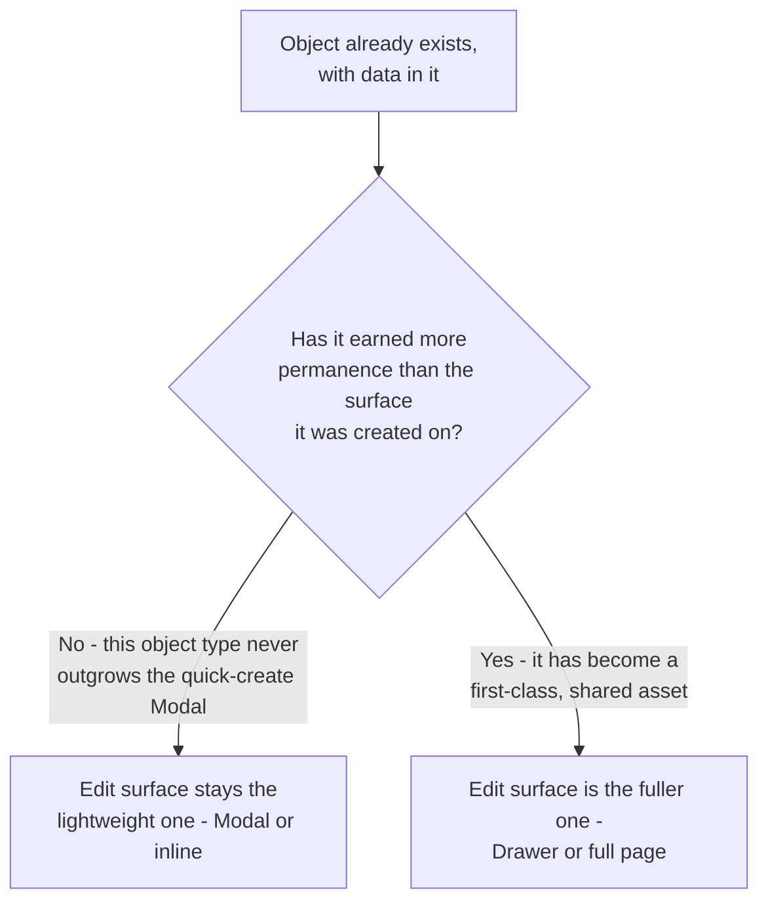

<Warning>
  **Exemplar page — first pass.** This is a proposal for review, not established policy — see
  [CRUD overview](/invoca-design-system/patterns/crud/overview#coverage-stated-honestly). This
  page reuses [Create](/invoca-design-system/patterns/crud/create)'s surface tree rather than
  walking it again — see [Choosing a surface, revisited](#choosing-a-surface-revisited) — and
  covers only what's genuinely different once an object already has data in it.
</Warning>

## The problem

Create decides where an object is born. Once it exists, editing it raises questions Create
never had to answer: the surface opens with values already in it, not a blank form: some edits
are small enough to commit the instant they're made, and others need everything held until an
explicit Save; the surface has to know whether anything has changed at all; and the object
might not be exactly as it was when the surface opened, if someone or something else touched it
in the meantime.

None of that is a new surface decision. It's what happens once the surface Create's tree
already chose is holding an object that isn't new anymore.

## Choosing a surface, revisited

[TITAN-CRUD-02](/invoca-design-system/patterns/crud/overview#constraints) states the default:
**the same object type uses the same surface for Create and Update, unless a stated reason
differs.** [Create](/invoca-design-system/patterns/crud/create#variations) already names the one
legitimate case where it does — this page resolves it rather than inventing a second answer.

A quick-create Modal is optimized for speed of *creating* something, not for that object's
whole life. Once the object exists, it has already earned whatever permanence its type implies
— and its ongoing edit surface is the surface that permanence calls for, even if the object was
born in a lighter one.

<Tip>
  **The exception is about the object type, not the individual object.** A **Tag** is created in
  a two-second Modal and is still edited through that same lightweight surface for as long as it
  exists — a Tag never earns more permanence than that, so there's nothing to graduate to. A
  **saved filter** is also quick-created in a Modal, but if it later becomes something people
  treat as a shared, first-class asset, its edit surface moves to the fuller one — Drawer or
  full page — at that point, not before. A **Campaign** or an **integration** never faces this
  question at all: both are already full-page objects from the moment they're created, so Create
  and Update land on the same surface with no exception needed.
</Tip>

## When this applies

- The object already exists and its data is being changed, not authored for the first time.
- The object was reached from [Create](/invoca-design-system/patterns/crud/create#when-it-doesnt)'s
  "duplicated from an existing one" case — the surface is Create's tree; the values arriving
  pre-filled from a template is this page's concern.

## When it doesn't

| Situation | Do this instead | Why |
|---|---|---|
| The object doesn't exist yet | [Create](/invoca-design-system/patterns/crud/create) | Nothing to prefill, no dirty state to track, until it exists. |
| A single field, no side effects on other data, no cross-field validation | [Inline editing](/invoca-design-system/patterns/inline-editing) | That page's own decision tree already answers this — see [TITAN-UPDATE-03](#constraints). Reopening a full edit surface for one field is the failure it exists to prevent. |
| The operation removes the object rather than changing it | [Destructive confirmation](/invoca-design-system/patterns/destructive-confirmation) | A different operation, governed by that pattern directly — CRUD has no separate Delete page. |

## Structure

| Order | Component | Role |
|---|---|---|
| 1 | The trigger — [Button](/invoca-design-system/components/actions/button), or the value itself with [Inline editing](/invoca-design-system/patterns/inline-editing)'s hover affordance for a single field | Opens the edit surface, or enters inline edit mode. |
| 2 | The surface — the same one [Create](/invoca-design-system/patterns/crud/create) uses for this object type, unless permanence has moved it per [Choosing a surface, revisited](#choosing-a-surface-revisited) | Holds the form, already filled with the object's current values. |
| 3 | [Form](/invoca-design-system/components/forms/form), [Input](/invoca-design-system/components/forms/input), [Select](/invoca-design-system/components/forms/select), etc. | Same fields as Create, prefilled — see [Behavior](#behavior) for load timing. |
| 4 | [Button](/invoca-design-system/components/actions/button) `contained` — commit, `text` — cancel | Per [TITAN-BTN-01](/invoca-design-system/components/actions/button#constraints) and [TITAN-DESTROY-05](/invoca-design-system/patterns/destructive-confirmation#constraints)'s ordering. Not present for a single-field edit — [Inline editing](/invoca-design-system/patterns/inline-editing#structure) has its own icon-only commit and cancel instead. |

## Behavior

| State | Behavior |
|---|---|
| Surface opens | Current values load and render before the surface accepts input — no flash of an empty form filling in a moment later. See [Loading & skeletons](/invoca-design-system/patterns/loading-and-skeletons) for the loading treatment while values are fetched. |
| A single field is edited | Commits through [Inline editing](/invoca-design-system/patterns/inline-editing#behavior)'s own commit and cancel behavior. Nothing else on the surface opens for it. |
| Multiple fields are edited in the surface | Nothing commits until the explicit Save is pressed. Every changed field commits together. |
| A field changes | The surface tracks dirty state — Save is enabled once anything differs from the loaded values. |
| Reader navigates away with unsaved changes | Follows [Destructive confirmation](/invoca-design-system/patterns/destructive-confirmation#when-it-doesnt)'s existing unsaved-edits guidance — a lightweight warning for anything non-trivially changed, nothing for an untouched surface. |
| The object changed on the server since the surface opened | Re-fetch at save time, the same rule [Destructive confirmation](/invoca-design-system/patterns/destructive-confirmation#behavior) already states for an object that changed while its dialog was open. If it changed, show the reader what changed and require re-confirmation before committing. |
| Save succeeds | Modal or Drawer closes with a [Toast](/invoca-design-system/components/feedback/toast) confirming, per [Create](/invoca-design-system/patterns/crud/create#behavior)'s own success behavior; a full-page or Detail-view edit confirms in place. |
| Save fails | The surface stays open with the entered values intact and the error shown inline — the same reasoning [Inline editing](/invoca-design-system/patterns/inline-editing#constraints) already states for a failed single-field save, applied to the whole surface. |

## Constraints

| ID | Constraint | Rationale |
|---|---|---|
| **TITAN-UPDATE-01** | The surface for editing an object is the same one used to create it, unless the object has earned more permanence than that surface implies since creation — in which case the fuller surface (Drawer or full page) is used. | Per [TITAN-CRUD-02](/invoca-design-system/patterns/crud/overview#constraints) — a quick-create Modal is optimized for speed of creation, not for the object's whole life. |
| **TITAN-UPDATE-02** | An object type that never earns more permanence than its quick-create Modal is edited on that same Modal for its whole life. An object type that can graduate to a first-class, shared asset moves its edit surface to the fuller one when that happens, not before. | The exception in TITAN-UPDATE-01 is about the object *type*, not a mood or a preference — a Tag has nothing to graduate to; a saved filter does, conditionally. |
| **TITAN-UPDATE-03** | A single field with no side effects and no cross-field validation commits through [Inline editing](/invoca-design-system/patterns/inline-editing), never by reopening the object's full edit surface. | That page's decision tree already answers this. Update does not re-decide it. |
| **TITAN-UPDATE-04** | A multi-field edit commits nothing until an explicit Save is pressed; every changed field commits together. | Partial application of a multi-field edit can leave the object in a combination of values the reader never intended and never saw on screen at once. |
| **TITAN-UPDATE-05** | The edit surface loads current values before it accepts input. It never renders empty fields that fill in a moment later. | See [Loading & skeletons](/invoca-design-system/patterns/loading-and-skeletons#constraints) — a flash of empty-then-filled reads as the values being cleared, not as them loading. |
| **TITAN-UPDATE-06** | Navigating away from an edit surface with unsaved changes follows [Destructive confirmation](/invoca-design-system/patterns/destructive-confirmation#when-it-doesnt)'s existing unsaved-edits guidance, not a rule invented here. | One definition of "leaving with unsaved work," not two that can disagree — the same reasoning [TITAN-INLINE-08](/invoca-design-system/patterns/inline-editing#constraints) already states for a single field. |
| **TITAN-UPDATE-07** | If the object changed on the server since the edit surface opened, the surface re-fetches at save time and requires re-confirmation before committing. | Matches [Destructive confirmation](/invoca-design-system/patterns/destructive-confirmation#behavior)'s own rule for an object that changed while its dialog was open — same underlying risk, same answer. |

## Content

| Element | ✅ | ❌ |
|---|---|---|
| Commit button | Save Campaign | Submit or Save |
| Single-field commit | Handled by [Inline editing](/invoca-design-system/patterns/inline-editing#content)'s own quiet return to resting state | A full Toast for a one-field save that Inline editing already handles without one |
| Unsaved-changes warning | Per [Destructive confirmation](/invoca-design-system/patterns/destructive-confirmation#content)'s existing copy | A separate warning invented for this page |

## Accessibility

- Opening the edit surface moves focus to its first field once values have loaded, matching
  [Create](/invoca-design-system/patterns/crud/create#accessibility)'s own behavior for a Modal
  or Drawer. Moving focus before values arrive would land the reader in a field about to change
  under them.
- A failed save's inline error is announced per
  [Inline editing](/invoca-design-system/patterns/inline-editing#accessibility)'s rule for a
  single field, or [Form validation](/invoca-design-system/patterns/form-validation)'s rule for
  a whole-surface save.
- The concurrent-edit re-confirmation states the specific change in its accessible description,
  not through color alone — the same requirement
  [Destructive confirmation](/invoca-design-system/patterns/destructive-confirmation#accessibility)
  already states for its own body text.

## Variations

| Variation | When | Change |
|---|---|---|
| Duplicate-then-edit | The object was created via [Create](/invoca-design-system/patterns/crud/create#when-it-doesnt)'s "duplicated from an existing one" path | Same surface as a normal edit; the values arrived pre-filled from a template rather than from the object's own prior save. |
| Saved filter graduates to a shared asset | The object's permanence changes after creation | Its edit surface moves from the lightweight one to the fuller one at that point, not before — see [TITAN-UPDATE-02](#constraints). |
| Quick edit reached from a Read surface | The reader is previewing the object in a Drawer or Detail view and wants to change one thing | Opens Update's own surface — Inline editing for a single field, the fuller surface otherwise. The Read surface itself never edits — see [Read](/invoca-design-system/patterns/crud/read#constraints)'s TITAN-READ-05. |

## Anti-patterns

**Editing a Tag on a full page because "editing deserves more room than creating."** The Tag's
permanence hasn't changed just because it now exists — see [TITAN-UPDATE-02](#constraints).

**Reopening the whole edit surface for a one-field change that Inline editing already covers.**
Adds a navigation and a full form for a change that takes one field and one second.

**Committing a multi-field edit field-by-field as each one changes, with no single Save.**
Leaves the object in a partially-applied combination of values nobody chose as a set.

**Silently discarding a save because the object changed on the server, with no way to see what
changed.** The reader loses their edit with no explanation — the same failure
[TITAN-DESTROY-09](/invoca-design-system/patterns/destructive-confirmation#constraints) already
names for a dialog that closes on failure.

## Related

[CRUD overview](/invoca-design-system/patterns/crud/overview), for the shared axes and
[TITAN-CRUD-02](/invoca-design-system/patterns/crud/overview#constraints), which this page
resolves. [Create](/invoca-design-system/patterns/crud/create), whose surface this page reuses
and whose Variations table first raised the pointer this page answers.
[Read](/invoca-design-system/patterns/crud/read), the sibling CRUD operation.
[Inline editing](/invoca-design-system/patterns/inline-editing), for a single field's whole
behavior. [Loading & skeletons](/invoca-design-system/patterns/loading-and-skeletons), for the
prefill-loading treatment. [Destructive confirmation](/invoca-design-system/patterns/destructive-confirmation)
and [Form validation](/invoca-design-system/patterns/form-validation), cited above rather than
restated.
