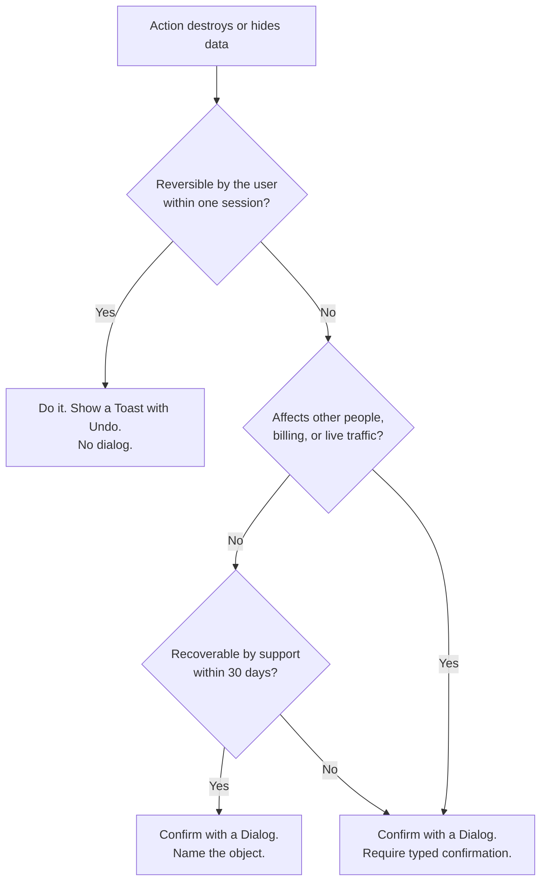

<Warning>
  **Exemplar page — first pass.** This is a *proposal* for review, not established policy.
  The thresholds in [TITAN-DESTROY-01](#constraints) especially are judgment calls that
  should be checked against real Invoca product flows before adoption.
</Warning>

## The problem

A user is about to do something that destroys work: delete a campaign, discard unsaved
edits, remove a team member, cancel a running job. Get this wrong in one direction and
people lose work they cannot recover. Get it wrong in the other and every routine action
grows a modal that users learn to dismiss without reading — which destroys the protection
for the cases that actually needed it.

The confirmation dialog is not the pattern. **The pattern is deciding whether to confirm
at all.**

## Decide first: undo, or confirm?



<Tip>
  **Undo beats confirmation whenever it is achievable.** A confirmation taxes every user
  every time, including the overwhelming majority who meant to do it. Undo taxes only the
  user who made a mistake. Building soft-delete so undo is possible is nearly always the
  better investment over adding a dialog.
</Tip>

## When this applies

- The action is not reversible by the user without contacting support.
- The action affects objects other people depend on — shared reports, live routing, team access.
- The action stops something currently running or generating revenue.

## When it doesn't

| Situation | Do this instead | Why |
|---|---|---|
| The action is reversible in-session | [Toast](/invoca-design-system/components/feedback/toast) with an Undo action | The dialog costs every user time to protect the few who erred |
| Removing an item from a draft or a working list | Remove it; offer Undo | Nothing is destroyed until the draft is saved |
| The user is leaving a page with unsaved edits | Save automatically, or a browser-level guard | A custom modal on navigation is routinely bypassed by the back button |
| The action is destructive *and* routine (bulk cleanup, log clearing) | [Bulk selection](/invoca-design-system/patterns/bulk-selection) with a single confirmation for the batch | Per-item confirmation on a routine task is how users learn to click through dialogs |

## Structure

| Order | Component | Role |
|---|---|---|
| 1 | [Dialog](/invoca-design-system/components/containment/dialog) | Container. Modal — this is one of the few cases where blocking is correct. |
| 2 | Dialog title | The question, naming the specific object |
| 3 | Dialog body | The consequence, stated in outcomes |
| 4 | [Input](/invoca-design-system/components/forms/input) | **Tier 3 only** — typed confirmation |
| 5 | [Button](/invoca-design-system/components/actions/button) `text` | Cancel. First in the group. |
| 6 | [Button](/invoca-design-system/components/actions/button) `outlined` | The destructive action. **Not `contained`.** |

```
┌─────────────────────────────────────────────┐
│  Delete "Q3 Paid Search"?                   │
│                                             │
│  This campaign has 1,284 calls attributed   │
│  to it. Reporting for those calls will no   │
│  longer be available. This cannot be undone.│
│                                             │
│                  [ Cancel ]  [ Delete ]     │
│                     text       outlined     │
└─────────────────────────────────────────────┘
```

<Warning>
  **The destructive action is never the `contained` Button.** See
  [TITAN-BTN-02](/invoca-design-system/components/actions/button#constraints). Weight is an invitation. The
  interface should be easy to escape and deliberate to commit. Severity is carried by the
  copy and the friction, not by making the dangerous control the most attractive one.
</Warning>

<Note>
  **A cascade adds one line to the body — never a second structure.** When the object being
  deleted has dependents, the body states what else is affected, alongside the object's own
  consequence:

  ```
  ┌─────────────────────────────────────────────┐
  │  Delete "Q3 Paid Search"?                   │
  │                                             │
  │  This campaign has 1,284 calls attributed   │
  │  to it. Reporting for those calls will no   │
  │  longer be available.                       │
  │                                             │
  │  It also has 3 routing rules that exist     │
  │  only for this campaign. Deleting it        │
  │  deletes those rules too.                   │
  │                                             │
  │  This cannot be undone.                     │
  │                  [ Cancel ]  [ Delete ]     │
  └─────────────────────────────────────────────┘
  ```

  See [TITAN-DESTROY-10](#constraints).
</Note>

## Three tiers of friction

Match friction to consequence. Using tier 3 everywhere is the same failure as using tier 1
everywhere — it just takes longer to show up.

<Steps>
  <Step title="Tier 1 — Undo. No dialog.">
    Reversible in-session. Perform the action, show a Toast with an Undo action for at
    least 10 seconds.

    *Removing a filter, archiving a draft, deleting a row from an unsaved table.*
  </Step>
  <Step title="Tier 2 — Dialog naming the object.">
    Not user-reversible, recoverable by support. Dialog states the object by name and the
    consequence in outcomes. Confirm button restates the action.

    *Deleting a saved report, removing a team member, deleting a campaign with history.*
  </Step>
  <Step title="Tier 3 — Typed confirmation.">
    Unrecoverable, or affects live traffic, billing, or other people's work. The user
    types the object's name to enable the confirm button.

    *Deleting a workspace, revoking an API key in production, cancelling a running job.*

    <Note>
      Typed confirmation works because it defeats muscle memory. Its power comes entirely
      from being rare. Use it in more than a handful of places and users learn to
      copy-paste, at which point it is friction with no protection.
    </Note>
  </Step>
</Steps>

## Behavior

| State | Behavior |
|---|---|
| Open | Focus moves to the **Cancel** button, not the destructive one |
| Escape / overlay click | Closes without acting. Always. No "are you sure you want to cancel." |
| Confirm pressed | Button enters `loading`, preserving width. Dialog stays open. |
| Success | Dialog closes, [Toast](/invoca-design-system/components/feedback/toast) confirms with the object's name |
| Failure | Dialog stays open, [Alert](/invoca-design-system/components/feedback/alert) appears inside it. **Never close a dialog on failure** — closing discards the user's context and they cannot tell whether it worked. |
| Object changed while dialog was open | Re-fetch on confirm. If it changed, show the change and require re-confirmation. |
| Object has dependents | The body states what else is affected — deleted with it, or orphaned instead — alongside the object's own consequence. See [TITAN-DESTROY-10](#constraints). |

## Constraints

| ID | Constraint | Rationale |
|---|---|---|
| **TITAN-DESTROY-01** | Confirm only when the action is not user-reversible. Otherwise perform it and offer Undo. | Confirmation on reversible actions trains users to dismiss dialogs, which removes the protection where it matters. |
| **TITAN-DESTROY-02** | The dialog title names the specific object. | "Delete this item?" gives the user nothing to check against. Naming the object is what allows them to catch that they selected the wrong row. |
| **TITAN-DESTROY-03** | The body states the consequence in outcomes, not mechanics. | "Reporting for 1,284 calls will no longer be available" is checkable. "This will delete the record" is not. |
| **TITAN-DESTROY-04** | Confirm button restates the action. Never "Yes", "OK", or "Confirm". | At the moment of commitment the user should not have to re-read the question to know what the button does. |
| **TITAN-DESTROY-05** | The destructive action is `outlined`; Cancel is `text` and comes first. | See [TITAN-BTN-02](/invoca-design-system/components/actions/button#constraints). |
| **TITAN-DESTROY-06** | Initial focus is on Cancel. | <kbd>Enter</kbd> on an unfamiliar dialog is common. The default outcome of a reflex should be the safe one. |
| **TITAN-DESTROY-07** | Typed confirmation is reserved for unrecoverable or externally-visible actions. | Its effectiveness is a function of its rarity. |
| **TITAN-DESTROY-08** | Never stack a second confirmation on a confirmation. | Two dialogs do not double the protection. They teach the user that dismissing dialogs is the normal path. |
| **TITAN-DESTROY-09** | On failure, the dialog stays open and shows the error inline. | Closing on failure discards context and leaves the user unable to determine what happened. |
| **TITAN-DESTROY-10** | A cascading delete's confirmation names what else is affected alongside the primary object — deleted with it, or orphaned instead — not just the object the reader selected. | The consequence must be stated in outcomes per [TITAN-DESTROY-03](#constraints), and a cascade's consequence includes objects the reader didn't select. |
| **TITAN-DESTROY-11** | Where a cascade orphans a dependent rather than deleting it, the dialog states which of the two happens, for which dependent. | "Deleted" and "orphaned" leave the product in different states — an orphaned object still exists and may need separate cleanup; a deleted one does not. |

## Constraints Titan should enforce

<Card title="Destructive confirmation: open issues" icon="triangle-exclamation" href="/invoca-design-system/patterns/destructive-confirmation/open-issues">
  Constraints Titan should enforce for Destructive confirmation.
</Card>

## Content

| Element | ✅ | ❌ |
|---|---|---|
| Title | Delete "Q3 Paid Search"? | Are you sure? |
| Body | This campaign has 1,284 calls attributed to it. Reporting for those calls will no longer be available. This cannot be undone. | This action is permanent. |
| Confirm | Delete campaign | Yes, I'm sure |
| Cancel | Cancel | No |
| Cascade line | It also has 3 routing rules that exist only for this campaign. Deleting it deletes those rules too. | This will also affect related data. |

**Do not apologize and do not soften.** "We're sorry, but this will permanently remove…"
adds words at the exact moment the user should be reading carefully. State the consequence
plainly and stop.

**Never use "Are you sure?"** It asks about the user's confidence when the useful question
is about the outcome. Someone who is sure they selected the right row, but didn't, answers
"yes" correctly and still loses their work. Naming the object is what catches the error.

## Accessibility

- Dialog uses `role="dialog"` with `aria-modal="true"`; title is referenced by `aria-labelledby`.
- Focus is trapped for the dialog's lifetime and returns to the triggering control on close.
- Initial focus lands on **Cancel** — see [TITAN-DESTROY-06](#constraints).
- <kbd>Escape</kbd> always closes without acting.
- The consequence text must be in the accessible description, not conveyed by an icon or by red text alone — see [TITAN-COLOR-03](/invoca-design-system/foundations/color#constraints).
- Typed confirmation inputs need a visible label stating exactly what to type; do not rely on placeholder text, which disappears on focus.

## Variations

| Variation | When | Change |
|---|---|---|
| Bulk destructive | Multiple objects selected | Title states the count; body names the highest-consequence item; a single confirmation covers the batch. See [Bulk selection](/invoca-design-system/patterns/bulk-selection#variations), which routes into this variation rather than confirming per row. |
| Cascade deletes dependents | Dependents have no independent purpose — a routing rule built only for this campaign | Body states they're deleted too. See [TITAN-DESTROY-10](#constraints). |
| Cascade orphans dependents | Dependents can exist without the parent — a tag also applied elsewhere | Body states they're kept but disconnected, not deleted. See [TITAN-DESTROY-11](#constraints). |
| Destructive with a safer alternative | Archive exists alongside delete | Offer Archive as the `outlined` action and demote Delete to `text` |
| Scheduled destructive | Deletion happens after a grace period | No confirmation dialog. State the deletion date and offer cancellation until then. |

## Anti-patterns

**Confirming everything.** The most common failure. Every confirmation reduces the
attention paid to the next one. A product where deleting a filter and deleting a workspace
both open a dialog has taught users that dialogs are noise.

**The scary dialog.** Red header, warning triangle, `contained` red button. It reads as
severe and behaves as an invitation — the most prominent, most attractive control on
screen is the destructive one. Users click the biggest button.

**"Are you sure?" with Yes/No.** Ambiguous at the moment of commitment, and it tests the
wrong thing. See [TITAN-DESTROY-04](#constraints).

**Delete with no undo and no confirmation.** Occasionally shipped on the reasoning that
the action is "obviously intentional." Mis-clicks are not intentional, and neither is
operating on the wrong row after a sort order changed underneath the user.

**Confirmation as a substitute for soft delete.** A dialog is cheaper to build than
recoverable deletion, so it gets chosen. It protects against mis-clicks and not against
mistakes — the user who confidently deletes the wrong campaign passes the dialog without
hesitating. Where the data matters, build the recovery.

**A cascade delete whose dialog only names the primary object.** The reader discovers what
else disappeared only after confirming — see [TITAN-DESTROY-10](#constraints).

**Treating "orphaned" and "deleted" as the same outcome in the dialog copy.** They leave the
product in different states, and the reader needs to know which one they're choosing — see
[TITAN-DESTROY-11](#constraints).

## Related

[CRUD overview](/invoca-design-system/patterns/crud/overview), for how this pattern is the
whole answer to CRUD's Delete operation — there is no separate Delete page. [Bulk selection](/invoca-design-system/patterns/bulk-selection),
which routes into this page's bulk-destructive variation rather than confirming per row.
