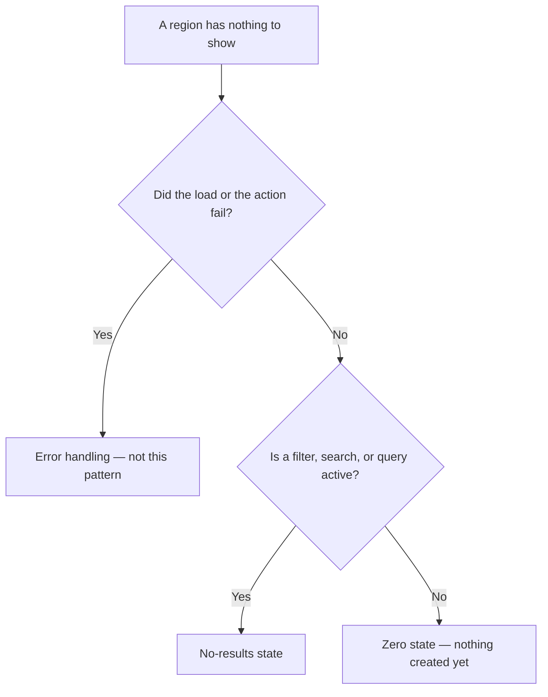

<Warning>
  **Exemplar page — first pass.** This is a *proposal* for review, not established policy. No
  Titan design-library review or shipped Invoca screen backs this page — it composes the real
  [EmptyState](/invoca-design-system/components/data-display/empty-state) component and the
  real [Empty state copy](/invoca-design-system/content/empty-state-copy) content rules, and
  cites their constraints rather than restating them. Where this pattern's guidance is new, it
  is a proposal to check against a real screen, not a decision already confirmed.
</Warning>

## The problem

A region with nothing in it is one of three genuinely different situations, and a reader
cannot tell them apart unless the interface says which:

1. **Nothing here yet.** The reader hasn't created anything. The right next step is to create
   the first one.
2. **Nothing matched.** Data exists; a filter, search, or query excluded all of it. The right
   next step is to widen or clear the narrowing.
3. **Something went wrong.** A load or an action failed, and the region is empty because the
   attempt to fill it didn't succeed. This is not this pattern's job — see
   [Error handling](/invoca-design-system/patterns/error-handling).

Conflating the first two is the most common failure: telling a brand-new account "no results"
describes their account as a failed search, and telling a searching reader "get started" reads
as a lost query, not a narrow one. Conflating either with the third is worse — a blank region
with no explanation is indistinguishable from a bug, whichever of the three actually happened.

This pattern is not the illustration. **The pattern is knowing which of the three situations
applies, and saying so in words, not only in a picture.**

## Deciding which case applies



## When this applies

- A region that normally holds content currently has none, and the load that would have
  produced content **completed successfully**.
- The reader benefits from knowing why the region is empty and, where one exists, what to do
  about it.
- The region is large enough that a bare line of text would read as a rendering failure rather
  than a message — see [EmptyState's own guidance](/invoca-design-system/components/data-display/empty-state#choose-emptystate-when).

## When it doesn't

| Situation | Do this instead | Why |
|---|---|---|
| The load or action that would fill the region failed | [Error handling](/invoca-design-system/patterns/error-handling) | An empty region is indistinguishable from a successful query with no matches — see [Table's own edge-state row](/invoca-design-system/components/data-display/table#edge-and-failure-states) making exactly this point. Showing "nothing here" for a failure hides that something needs fixing. |
| The region is still loading | [Loading & skeletons](/invoca-design-system/patterns/loading-and-skeletons) | Announcing "nothing here" and then filling the region contradicts itself — see [TITAN-EMP-06](/invoca-design-system/components/data-display/empty-state#constraints). |
| The emptiness is the result of an AI-driven feature — a first-run panel, or a search/summarize run that returned nothing | [Welcome / empty state](/invoca-design-system/ai-experience/actions/welcome-empty-state) | An agentic panel's emptiness carries an extra obligation this pattern doesn't cover: setting scope for what the feature can do, and distinguishing "ran and found nothing" from "hasn't been asked anything." That page's own "Choose this when / choose something else when" table points back here for the deterministic case. |
| There's still content, alongside a separate problem | [Alert](/invoca-design-system/components/feedback/alert) | An alert accompanies content; an empty state replaces it. Using an empty state where content still exists throws away what the reader had. |

## Structure

| Order | Component | Role |
|---|---|---|
| 1 | [EmptyState](/invoca-design-system/components/data-display/empty-state) | Illustration, title, and supporting line. Replaces the region's content, not the region. |
| 2 | [Button](/invoca-design-system/components/actions/button), link-styled | The single resolving action, composed after the component — no action slot exists on EmptyState itself. |
| 3 | [Table](/invoca-design-system/components/data-display/table) or [List](/invoca-design-system/components/data-display/list) column/row structure | Stays. A table's empty state replaces the rows, keeping the column headers so the region still reads as a table. |

```
┌─────────────────────────────────────────────┐
│  Campaigns          [Search] [Filter ▾]      │  ← Controls stay
├─────────────────────────────────────────────┤
│                                               │
│                    ◇                          │
│           No campaigns yet                    │
│    Create a campaign to start routing calls.  │
│                                               │
│              [ Create Campaign ]              │  ← link-styled, per TITAN-EMPTYCOPY-04
│                                               │
└─────────────────────────────────────────────┘
```

## Behavior

| State | Behavior |
|---|---|
| Zero state | Region has no rows because none were created. Illustration and copy state that plainly; action creates the first one. |
| No-results state | Region has no rows because a filter, search, or query excluded them all. Illustration and copy name the narrowing; action clears or widens it. |
| Filter cleared from a no-results state | Region returns to its prior content, or to a zero state if the underlying data genuinely doesn't exist either. |
| Load fails | Never rendered by this pattern — see [Error handling](/invoca-design-system/patterns/error-handling). |
| Load still in progress | Never rendered by this pattern — see [TITAN-EMP-06](/invoca-design-system/components/data-display/empty-state#constraints). |
| Resolving action taken | Region either fills with new content or, if the action itself can fail (e.g. a widen-filter call), follows [Error handling](/invoca-design-system/patterns/error-handling) rather than staying on the empty state silently. |

## Constraints

| ID | Constraint | Rationale |
|---|---|---|
| **TITAN-ZERO-01** | A region with nothing to show states which of the three causes applies. Never one generic message for all of them. | See [TITAN-EMP-02](/invoca-design-system/components/data-display/empty-state#constraints) and [TITAN-EMPTYCOPY-03](/invoca-design-system/content/empty-state-copy#constraints) — do not restate their reasoning, follow it. |
| **TITAN-ZERO-02** | A failed load never renders through this pattern. Route it to [Error handling](/invoca-design-system/patterns/error-handling). | An empty table and a failed one look identical without a stated cause — see [Table's own edge-state row](/invoca-design-system/components/data-display/table#edge-and-failure-states). |
| **TITAN-ZERO-03** | This pattern never replaces a region that is still loading. | See [TITAN-EMP-06](/invoca-design-system/components/data-display/empty-state#constraints). |
| **TITAN-ZERO-04** | The resolving action, when one exists, is exactly one action, styled as a link button, placed after the component. | See [TITAN-EMP-05](/invoca-design-system/components/data-display/empty-state#constraints) and [TITAN-EMPTYCOPY-04](/invoca-design-system/content/empty-state-copy#constraints). |
| **TITAN-ZERO-05** | A table or list's empty state replaces the rows, not the container. Column headers and filter controls stay. | See [TITAN-TBL-04](/invoca-design-system/components/data-display/table#constraints) — the reader whose filter matched nothing still needs the filter, in order to change it. |
| **TITAN-ZERO-06** | An AI-driven feature's first-run or no-results moment uses [Welcome / empty state](/invoca-design-system/ai-experience/actions/welcome-empty-state), not this pattern. | An agentic panel's emptiness carries a scope-setting obligation — what the feature can and can't do — that a deterministic region never has to carry. |
| **TITAN-ZERO-07** | The illustration matches the case: a zero-state illustration is never reused for no-results, and neither is reused for a failure. | See [TITAN-EMP-03](/invoca-design-system/components/data-display/empty-state#constraints) — the illustration is read before the text, and one that contradicts the message costs the reader the time it takes to notice. |
| **TITAN-ZERO-08** | Copy names the real thing missing — campaigns, calls, contacts — never a generic word like "records" or "data." | See [TITAN-EMPTYCOPY-05](/invoca-design-system/content/empty-state-copy#constraints) (proposed). |

## Content

| Element | ✅ | ❌ |
|---|---|---|
| Zero-state title | No campaigns yet | Empty |
| No-results title | No campaigns match these filters | No results |
| Zero-state supporting line | Create a campaign to start routing calls. | This page has no data. |
| No-results supporting line | Try removing a filter or broadening your search. | Nothing found. |
| Action | Create Campaign (link-styled) | [Create Campaign] as a solid button |

**Never fall back to the component's default message** ("No Records found!") for either case
— it names neither cause and satisfies none of the rules above. Always pass an explicit title.

## Accessibility

- The title is real text, not baked into the illustration — an illustration carrying the
  message is invisible to a screen reader. See
  [EmptyState's own accessibility section](/invoca-design-system/components/data-display/empty-state#accessibility).
- An empty state that appears in response to an action — clearing a filter, running a search —
  is announced. Nothing about the component announces itself; the region that swapped its
  content owns that announcement.
- The illustration carries no information the text doesn't already state; it is decorative.

## Variations

| Variation | When | Change |
|---|---|---|
| No-results with an active filter | A filter or search excluded existing rows | `search` illustration; resolving action clears or widens the filter |
| Zero state, first run | Nothing created yet on this account or page | `default`, `discover`, or subject-specific illustration; resolving action creates the first record |
| Zero state with no permission to act | The reader could not create one even if they tried | Omit the action; state the reason instead — same reasoning as a disabled control needing a reachable explanation, see [TITAN-BTN-06](/invoca-design-system/components/actions/button#constraints) |
| Small region — a card, a sidebar panel | Too small for the 320px illustration | A line of text instead of EmptyState — see [EmptyState's own "choose something else when"](/invoca-design-system/components/data-display/empty-state#choose-something-else-when) |

## Anti-patterns

**The same message for a zero state and a no-results state.** "No campaigns yet" shown to a
reader who just typed a search that matched nothing tells them to go create something that
already exists. See [TITAN-EMP-02](/invoca-design-system/components/data-display/empty-state#constraints).

**An empty state shown during a load.** The region says "nothing here," then fills a moment
later — the reader who read the first message already believes it and may navigate away before
the real content arrives.

**A blank region with no explanation at all.** Cheaper to ship than any of the three real
cases, and indistinguishable from a bug no matter which of the three actually happened.

**Using an empty state to quietly absorb a failure.** Showing "nothing here yet" when the
actual cause is a failed request hides that something needs fixing, and sends the reader down
the wrong path — creating a record that already exists, or waiting for data that will never
arrive because the load never ran.
