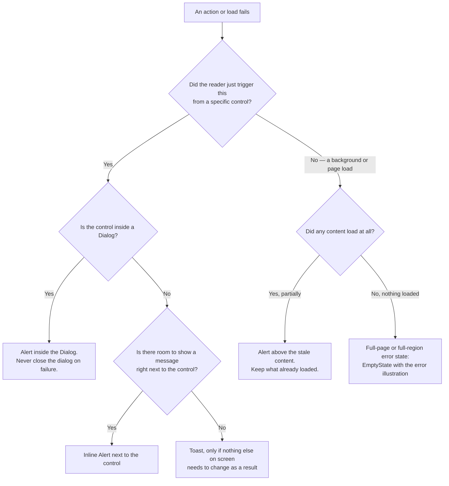

<Warning>
  **Exemplar page — first pass.** This is a *proposal* for review, not established policy. It
  is also a proposal for how to improvise a failed state at all — not a claim that Titan
  already has one. Checked directly against source:
  **[TITAN-GAP-22](/invoca-design-system/foundations/open-decisions#titan-gap-22)** — no
  component in Titan expresses a failed action today. There is a `loading` state and a
  `disabled` state, and nothing between them for failure, and no token names a control-level
  error state. Every product surface currently improvises this — inline text, a toast, a
  banner, or nothing — and what follows is a proposal for improvising it consistently, not a
  description of an existing primitive.
</Warning>

<Note>
  **This page covers deterministic failures only** — a failed API call, a failed save, a page
  that couldn't load. Where the "failure" is a wrong-but-confident model output rather than an
  exception, see [AI Experience overview](/invoca-design-system/ai-experience/overview#outcome-states),
  which defines a richer outcome-state model (working, streaming, confident-and-wrong,
  degraded, and more) for anything model-backed. Nothing on this page applies to that case.
</Note>

## The problem

An action or a load can fail for reasons that have nothing to do with the reader — a network
blip, a downstream service down, a permission that changed underneath them. Without a
consistent answer for where that failure shows up, every team invents its own: an inline
message here, a toast there, a full-page blank somewhere else, and occasionally nothing at
all, which is the worst of the four because the reader cannot tell a failure from success.

Where a failure shows matters as much as whether it shows. A message far from the control that
triggered it makes the reader hunt for what it's about. A toast that vanishes in five seconds
gives someone reading slowly nothing to act on. A dialog that closes on failure discards the
one piece of context the reader needs to know whether their input survived.

This pattern is not the Alert or the Toast. **The pattern is deciding, for a given failure,
which of Titan's feedback components is the right place to show it, and what happens next.**

## Deciding where a failure shows



## When this applies

- An action the reader took — save, submit, delete, export — did not complete successfully.
- A load — a page, a table, a panel — failed to retrieve what it needed, in whole or in part.
- The failure is deterministic: an exception, a rejected request, a timeout. There is a
  definite thing that went wrong, not a model output that might be wrong.

## When it doesn't

| Situation | Do this instead | Why |
|---|---|---|
| The output is a model-generated answer that could be confidently wrong, not an exception | [AI Experience overview — outcome states](/invoca-design-system/ai-experience/overview#outcome-states) | That page's outcome-state model exists precisely because "the request completed, but the content is wrong" isn't expressible by an exception-based error state. |
| A region legitimately has nothing to show, and the load succeeded | [Empty & zero states](/invoca-design-system/patterns/empty-and-zero-states) | An empty result and a failed one look identical without a stated cause — this page's job is the failed half of that distinction. |
| A form field's value is invalid before the reader submits | [Form validation](/invoca-design-system/patterns/form-validation) | Field-level validation happens before a request is even sent; there is no failed action yet. |
| Content is still on its way and hasn't had the chance to fail | [Loading & skeletons](/invoca-design-system/patterns/loading-and-skeletons) | Showing a failure before the load has had time to succeed or fail isn't a failure state — it's a race condition. |

## Structure

| Order | Component | Role |
|---|---|---|
| 1 | Trigger control (e.g. [Button](/invoca-design-system/components/actions/button)) | The control that failed. Returns to its resting state — Button's own behavior is undefined here, so the composition around it owns the message. |
| 2 | [Alert](/invoca-design-system/components/feedback/alert) | The message: inline beside the control, above stale content, or inside a Dialog. |
| 3 | [Toast](/invoca-design-system/components/feedback/toast) | For a failure with no further reader action needed and nothing else on screen to update — sparingly, since it self-dismisses. |
| 4 | [EmptyState](/invoca-design-system/components/data-display/empty-state), `error` illustration | Full-page or full-region failure: nothing loaded at all. |
| 5 | [Button](/invoca-design-system/components/actions/button) `Retry` | Composed after the message. Resolves the failure by re-attempting it. |

```
┌─────────────────────────────────────────────┐
│  [ Save Changes ]                            │
│  Campaign could not be saved. Try again.     │
│                                  [ Retry ]    │
└─────────────────────────────────────────────┘
```

## Behavior

| State | Behavior |
|---|---|
| Control-level action fails | The control returns to its resting state (not disabled, not loading). An [Alert](/invoca-design-system/components/feedback/alert) appears beside it, stating what happened and how to resolve it. |
| Failure occurs inside a Dialog | The dialog **stays open**; an Alert appears inside it. Never close a dialog on failure — see [TITAN-DESTROY-09](/invoca-design-system/patterns/destructive-confirmation#constraints), which this page follows rather than restates. |
| Partial page or table load failure | Existing, already-loaded content stays on screen. An Alert appears above it, stating that a refresh or a subsequent request failed — see [Table's own edge-state row](/invoca-design-system/components/data-display/table#edge-and-failure-states). |
| Full load failure — nothing rendered at all | The region shows an [EmptyState](/invoca-design-system/components/data-display/empty-state) with the `error` illustration and a Retry action, replacing the region's content since there was none to preserve. |
| Retry pressed | The retry control enters `loading`; the same message stays in place until the result is known, then either clears (success) or updates (failed again). |
| First automatic retry (network-layer, transient) | May happen silently, once, before anything is shown to the reader. |
| Retry fails again, past the first automatic attempt | Becomes fully user-triggered. No further silent retries. |
| N consecutive retries fail | The message states that the failure has recurred, not just that it failed again — see [TITAN-ERRHANDLE-09](#constraints). |

## Constraints

| ID | Constraint | Rationale |
|---|---|---|
| **TITAN-ERRHANDLE-01** | A failure renders as close to the control that caused it as the composition allows. | See [TITAN-ERR-02](/invoca-design-system/content/error-messages#constraints) — follow it, don't restate it. |
| **TITAN-ERRHANDLE-02** | A failure inside a Dialog never closes the dialog. The Alert renders inside it. | See [TITAN-DESTROY-09](/invoca-design-system/patterns/destructive-confirmation#constraints) — closing on failure discards the reader's context and they cannot tell whether it worked. |
| **TITAN-ERRHANDLE-03** | A partial load failure keeps whatever content already loaded. The failure is an Alert placed above it, never a replacement. | See [TITAN-ALR-04](/invoca-design-system/components/feedback/alert#constraints) — replacing the content throws away what the reader had. |
| **TITAN-ERRHANDLE-04** | A failure with nothing to preserve — the first load failed entirely — uses EmptyState's `error` illustration with a Retry action. | See [TITAN-EMP-03](/invoca-design-system/components/data-display/empty-state#constraints) — the illustration must match the meaning; `error` is the one that says "this failed," not "there's nothing here." |
| **TITAN-ERRHANDLE-05** | The message states what happened and how to resolve it, never only that something went wrong. | See [TITAN-ERR-03](/invoca-design-system/content/error-messages#constraints) — follow it, don't restate it. |
| **TITAN-ERRHANDLE-06** | At most one silent, automatic retry. Anything past that is user-triggered. | A silent retry loop hides an ongoing problem from the person waiting on it, and never gives them a moment to decide to stop waiting. |
| **TITAN-ERRHANDLE-07** | A control that fails returns to its resting state and never uses `disabled` as its only signal of failure. | Disabled announces nothing and is indistinguishable from "you don't have permission" or "select a row first" — see [Button's edge-state row](/invoca-design-system/components/actions/button#edge-and-failure-states), which states plainly that the Button does not own error display. |
| **TITAN-ERRHANDLE-08** | Never route a single action's failure through a product-wide announcement. | No Banner ships in Titan today — see [Banner](/invoca-design-system/components/feedback/banner) — and even if one did, a single action's failure is scoped to that action, not the whole product. |
| **TITAN-ERRHANDLE-09** | A failure that recurs after repeated retries states that it has recurred, not just that it failed again. | Identical repeated messaging teaches the reader nothing new about whether retrying alone is going to work. |

## Content

| Element | ✅ | ❌ |
|---|---|---|
| Inline failure | Campaign could not be saved. Try again. | An error occurred. |
| Retry action | Retry | OK |
| Recurring failure | Still failing after several tries. Check your connection and try again. | Error |
| Full-page failure | This page couldn't load. Try again. | Something went wrong. |

Sentence case, no exclamation marks, and a stated next step in every message — see
[Error messages](/invoca-design-system/content/error-messages#constraints), which this page
follows rather than restates.

## Accessibility

- An Alert that appears after page load carries a live-region role so a screen reader user
  hears it — see [TITAN-ALR-08](/invoca-design-system/components/feedback/alert#constraints).
- Severity is carried by the icon and the words, not only by color — see
  [TITAN-ALR-09](/invoca-design-system/components/feedback/alert#constraints).
- A control's `loading` state during a retry sets `aria-busy="true"` automatically — see
  [Button](/invoca-design-system/components/actions/button#accessibility) — but the failure
  message that follows is a separate announcement the composition still has to make.
- A full-page error state should move focus to its heading once it replaces a loading region,
  so a screen reader user lands on the result rather than on a control that no longer has
  anything to act on.

## Variations

| Variation | When | Change |
|---|---|---|
| Field-level validation failure | The failure is a bad input value, not a failed action | Route to [Form validation](/invoca-design-system/patterns/form-validation) instead — this pattern doesn't cover it. |
| Background auto-save failure | Low-stakes, silently retriable | A single [Toast](/invoca-design-system/components/feedback/toast), since the retry is automatic and there's nothing for the reader to review. |
| Full-page load failure | Nothing on the page loaded at all | [EmptyState](/invoca-design-system/components/data-display/empty-state)'s `error` illustration fills the region; Retry re-runs the entire load. |
| Bulk action partial failure | Multiple rows selected, some succeed, some fail | See [Bulk selection](/invoca-design-system/patterns/bulk-selection#behavior) for how selection and messaging split between the two outcomes. |

## Anti-patterns

**A toast with no path to retry or recover.** A transient notification that vanishes in five
seconds is the wrong place for a failure the reader is expected to act on — there is nothing
left on screen once it's gone.

**Closing a dialog on failure.** The reader is left unable to tell whether their input
survived, and has to redo work that may already have gone through. See
[TITAN-DESTROY-09](/invoca-design-system/patterns/destructive-confirmation#constraints).

**Silent, unbounded automatic retry.** A request that keeps failing quietly in the background
never gives the reader a signal that something is actually wrong, and never hands them a way
to stop waiting.

**A disabled control as the only sign that something failed.** Indistinguishable from "you
don't have permission," "select a row first," or a bug — three different messages that all
render identically with nothing said.
