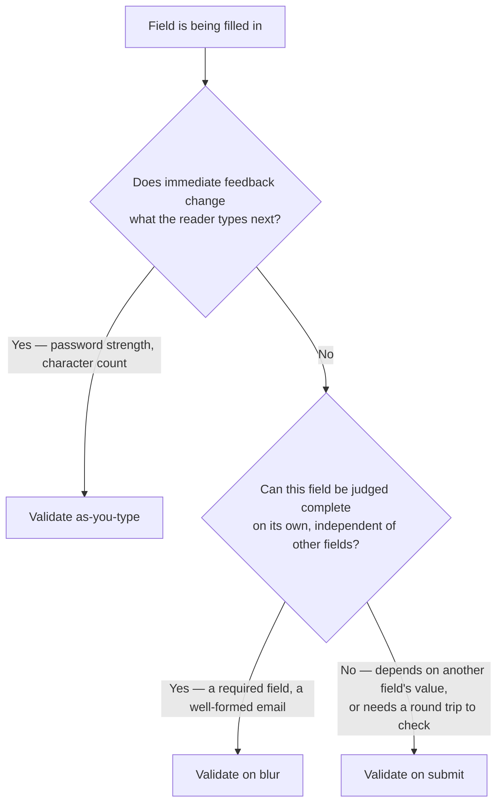

## The problem

A form with several fields needs to tell the reader which ones are wrong before it can be
submitted, without interrupting every keystroke with a red border and without waiting until
submission to report a mistake made in the first field. Two separate decisions travel under one
name here: **when** to check a field, and **where** to show the result. Getting the timing wrong
either marks a field invalid before the reader has finished typing it, or defers every error to a
full-page failure discovered only on submit. Getting the placement wrong disconnects the message
from the field it is about.

On a long or tabbed form, a third problem appears that a single field's validation does not have:
the invalid field can be out of view entirely — scrolled past on a long page, or on a tab the
reader is not looking at. Nothing about validating one field in isolation explains what should
happen when the invalid one isn't the one currently in front of the reader — and the shipped tab
bar itself has no way to flag which section holds the problem, a real gap this page's tabbed-form
guidance has to work around (see [Known issues](#known-issues)).

## When to validate



<Tip>
  **As-you-type is the exception, not the default.** It earns its cost only when the feedback
  itself is the point — a password-strength meter, a character counter approaching a limit. Most
  fields have nothing useful to say about a value that isn't finished yet, and flagging one red
  mid-keystroke reads as the form being broken rather than helpful.
</Tip>

## Vocabulary

| Term | Also called | The system uses |
|---|---|---|
| Validate | Check, verify | **Validate** — testing a field's value against a rule, at a defined moment (as-you-type, on blur, or on submit) |
| Error summary | Error banner, validation summary | **Page-level error summary** — a list of every invalid field, used only once a form is long or tabbed enough that an invalid one can be out of view |
| Blur | Focus-out, on-leave | **Blur** — the moment focus leaves a field, the default point to validate a field judgeable on its own |

## When this applies

- A form has one or more fields whose values need to be checked against a rule before the form
  can be submitted or a record saved.
- The check is a validation of a value, not a confirmation of an action's consequences.

## When it doesn't

| Situation | Do this instead | Why |
|---|---|---|
| The action itself destroys data or is otherwise consequential, not just an invalid value | [Destructive confirmation](/invoca-design-system/patterns/destructive-confirmation) | Confirming before an irreversible action is a different decision than validating a field's contents |
| A required field is empty because its data hasn't loaded yet | [Loading & skeletons](/invoca-design-system/patterns/loading-and-skeletons) | An empty field mid-load is not the same case as one the reader left blank |
| The whole view has nothing to show | [Empty & zero states](/invoca-design-system/patterns/empty-and-zero-states) | No data existing is a different case than a value failing a rule |
| An action fails after the value was already valid — a network or server error on submit | [Error handling](/invoca-design-system/patterns/error-handling) | Field validation is about the value being checked; a failed submission is about the action that used it, after the fact |

## Structure

| Order | Component | Role |
|---|---|---|
| 1 | [FieldLabel](/invoca-design-system/components/forms/field-label) | Names the field; its shared helper/error slot renders the message |
| 2 | [Input](/invoca-design-system/components/forms/input) or [Select](/invoca-design-system/components/forms/select) | The field itself, always composed via `FormInput` rather than the raw underlying field |
| 3 | [Alert](/invoca-design-system/components/feedback/alert) `error` | Page-level error summary — **only on a long or tabbed form**, see [Constraints](#constraints) |
| 4 | [Button](/invoca-design-system/components/actions/button) `primary` | Submit — re-validates on press |

```
┌───────────────────────────────────────────────────────┐
│  ⚠ 2 fields need attention:                            │
│    • Email address — Enter a valid email address       │
│    • Routing rule (Routing tab) — Select a destination │
│                                                          │
│  Email address                                          │
│  [ not-an-email             ]                           │
│  Enter a valid email address                            │
│                                                          │
│  Company name                                            │
│  [ Acme Corp                ]                           │
│                                                          │
│                              [ Cancel ]  [ Save ]        │
└───────────────────────────────────────────────────────┘
```

Per [FieldLabel](/invoca-design-system/components/forms/field-label#edge-and-failure-states), a
field's helper text and error text occupy one shared slot — the error replaces the helper, it
never renders alongside it. The error always renders **below** the field, in that slot, matching
the confirmed reading order (label, field, then helper-or-error) on FieldLabel's own page.

## Behavior

| State | Behavior |
|---|---|
| Field validated as-you-type | Feedback updates on every keystroke — reserved for fields where that feedback changes what's typed next |
| Field validated on blur | Checked once focus leaves it; no error shows while the reader is still typing |
| Field validated on submit | Checked when Submit is pressed, for fields that need another field's value or a round trip |
| Field is invalid | Border and focus ring switch to error tokens; error text replaces helper text in the shared slot — per [Input](/invoca-design-system/components/forms/input#edge-and-failure-states) |
| Submit pressed with invalid fields | Submission is blocked; focus moves to the first invalid field; a page-level summary appears if the form is long or tabbed |
| A field is corrected after a failed submit | Re-validates on blur (or as-you-type, per its own timing) — the reader is not forced to press Submit again just to clear one field's error |
| Invalid field is on a tab not currently open | **No shipped per-tab signal exists** — see [Known issues](#known-issues). The page-level error summary is the only route to it, since it can link across tab boundaries |

## Constraints

| ID | Constraint | Rationale |
|---|---|---|
| **TITAN-FORMVAL-01** | Validate as-you-type only when the feedback itself is what the reader needs to decide what to type next — a strength meter, a character count. Every other field validates on blur or on submit. | Flagging an unfinished value as wrong reads as the form failing, not helping — most rules can't be judged until the reader has stopped typing. |
| **TITAN-FORMVAL-02** | A field validates on blur when it can be judged complete on its own. It validates on submit only when it depends on another field's value or requires a round trip. | Waiting until submit for a check that could run on blur defers a correction the reader could have made immediately. |
| **TITAN-FORMVAL-03** | Error text renders in the field's own helper/error slot, directly below the field. It never renders only in a separate summary. | A message should not require the reader to search the screen to connect it to the field it's about. |
| **TITAN-FORMVAL-04** | A page-level error summary is used only on a form long enough that an invalid field can be out of view, or tabbed. A short, single-view form does not get one. | A summary above a form the reader can already see in full repeats information sitting two lines below it. |
| **TITAN-FORMVAL-05** | On a tabbed form, the page-level error summary links each entry to its specific field, naming the tab it's on. | This is the workaround for the shipped tab bar's own missing per-tab error signal — see [Known issues](#known-issues) — the summary is the only place that can say which section holds the problem. |
| **TITAN-FORMVAL-06** | Submitting with invalid fields moves focus to the first invalid field, not to the error summary. | The summary is a map; the field is the destination. Landing on the summary adds a step for a reader who still has to find the field afterward. |
| **TITAN-FORMVAL-07** | A field corrected after a failed submit re-validates on its own configured timing (blur or as-you-type) — it is never left showing a stale error until the next full submit. | Requiring a second full submission to clear one field's error punishes the reader for the same mistake twice. |
| **TITAN-FORMVAL-08** | Error message content states the correction, not only the failure. | "Invalid" tells the reader nothing about what to do next — the same reasoning [Error messages](/invoca-design-system/content/error-messages) and [FieldLabel](/invoca-design-system/components/forms/field-label) already state for their own copy rules. |

## Content

| Element | ✅ | ❌ |
|---|---|---|
| Field error | Enter a valid email address | Invalid |
| Required field left blank | Enter a company name | This field is required. |
| Page-level summary heading | 2 fields need attention | Errors |
| Summary entry (tabbed form) | Routing rule (Routing tab) — Select a destination | Routing rule — invalid |

All error copy is sentence case — see [Error messages](/invoca-design-system/content/error-messages)
for the full copy rules this pattern inherits rather than restates.

## Accessibility

- An invalid field sets `aria-invalid="true"` in addition to the visible color and text change —
  per [Input](/invoca-design-system/components/forms/input#accessibility), the visual swap alone
  is not reliably announced.
- The error text is associated to its field via `aria-describedby`, so it is read immediately
  after the field itself, not only when the reader happens to look down at it.
- On a blocked submit, focus moves to the first invalid field — this is a focus change a
  screen-reader user needs, not just a visual one, since nothing else tells them where to go.
- A page-level error summary is announced as a whole when it appears (a live region, or focus
  landing on its heading) — but focus moves on to the first field immediately after, not left
  resting on the summary.
- As-you-type feedback (a strength meter, a character count) updates a live region sparingly —
  announcing every keystroke is unusable; announce on a meaningful change in the result, not on
  every character.

## Variations

| Variation | When | Change |
|---|---|---|
| Single-field validation | One field, no other context | Error renders in the field's own slot only; no page-level summary |
| Long single-page form | Several fields, one scrollable view, no tabs | Page-level summary added once the form is long enough that scrolling past an invalid field is likely |
| Tabbed form | Fields spread across tab sections | Page-level summary is required, not optional — it is the only cross-tab signal until the tab bar's own missing error state ships (see [Known issues](#known-issues)) |

## Anti-patterns

**Validating every field as-you-type by default.** A required-field check that turns red the
moment the reader starts typing punishes them for a value that isn't finished, not for a value
that's wrong.

**An error summary with no link to the field.** A list of "2 errors" at the top of a long form
that doesn't jump to or name the specific field forces the reader to hunt for what it means —
the summary exists to shorten that hunt, not relocate it.

**Deferring every check to submit.** A form that says nothing until the reader presses Submit,
then reports every mistake at once, spends the reader's effort on fields they had already
finished and moved past minutes earlier.

**Treating the tab-bar's silence about errors as settled.** Building a tabbed form and assuming a
future version will surface a per-tab error marker is building against a real, open gap as if it
were already closed. It isn't — the page-level summary is required precisely because the tab bar
can't do this today.

## Known issues

| ID | Kind | What |
|---|---|---|
| [TITAN-GAP-30](/invoca-design-system/foundations/open-decisions#titan-gap-30) | Open decision | The design library specifies an `Error` display state for a tab; the shipped tab component has no equivalent, so an invalid field on an unopened tab has no per-tab signal — this page's page-level summary constraint exists specifically to work around this. |

## Gaps in the current rules

- Whether a field's error should persist if the reader navigates to a different tab and back
  without correcting it, or whether re-focusing it should re-check silently.
- Whether an async, round-trip validation (a uniqueness check, an availability check) needs its
  own transient loading state on the field, distinct from the form's overall submit-in-flight
  state — [Structure](#structure) and [Behavior](#behavior) don't cover it.
- What a reader sees between pressing Submit and a round-trip validation's result returning, for
  a field that depends on a server check.

## Why it works this way

**Timing and placement are two separate decisions because they fail independently.** A field
validated at the right moment but reported in the wrong place still sends the reader hunting; a
field reported in the right place but checked too early still reads as broken before it's
finished. Treating them as one decision is how a page ends up validating everything as-you-type
simply because that's also when it happens to render the message closest to the field.

**The page-level summary is a concession to a gap, not a preferred pattern.** It's restricted to
long or tabbed forms specifically because a summary above a form the reader can already see
whole just repeats what the field-level message already says. It earns its place only where the
tab bar's own missing error signal leaves no other way to point at an invalid field the reader
isn't looking at.

## Related

[Input](/invoca-design-system/components/forms/input), [Select](/invoca-design-system/components/forms/select),
and [FieldLabel](/invoca-design-system/components/forms/field-label) — the components this
pattern composes with. [Error messages](/invoca-design-system/content/error-messages) — the copy
rules this page's Content section follows rather than restates.
[Views overview](/invoca-design-system/views/overview) and
[TITAN-GAP-30](/invoca-design-system/foundations/open-decisions#titan-gap-30) — the tab-error gap
this page's tabbed-form guidance works around.

## Status

**Proposal — first pass, not an audited Invoca screen.** No Titan design library or shipped
product surface was available while writing this page. What follows is built from general
interaction-design practice and from the constraints Foundations and Components already
establish — see [Status](/invoca-design-system/patterns/overview#status).
One real, already-documented gap is directly load-bearing for the tabbed case below:
[TITAN-GAP-30](/invoca-design-system/foundations/open-decisions#titan-gap-30) — the design
library's tab component has an `Error` display state and the shipped code has no error
treatment for a tab at all. If an invalid field sits on a tab the reader isn't looking at,
**there is currently no shipped way to flag that tab.** The page-level error summary proposed
below is a workaround for that real gap, not a claim that it is closed.
