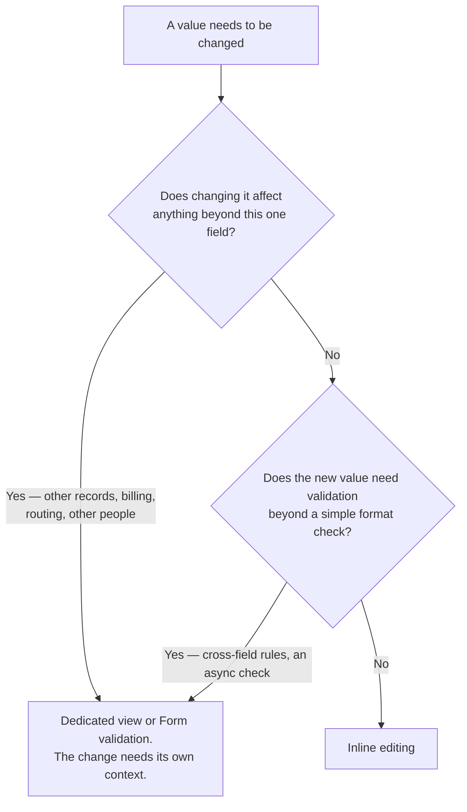

<Warning>
  **Proposal — first pass, not an audited Invoca screen.** No Titan design library or shipped
  product surface was available while writing this page. What follows is built from general
  interaction-design practice and from the constraints Foundations and Components already
  establish — see [Coverage, stated honestly](/invoca-design-system/patterns/overview#coverage-stated-honestly).
</Warning>

## The problem

Changing one small value — a name, a status, a quantity — sometimes gets a whole navigation to a
dedicated edit page for a change that takes one field and one second to type. That round trip
costs the reader a page load out and a page load back for a change that didn't need either. But
inline editing isn't free of cost either: it has to signal that a value is editable at all before
anyone clicks it, it has to make committing and cancelling both obvious, and it has to say what
happens to the value if the save fails while the reader has already moved on.

The failure mode in each direction is different. Skip inline editing where it belongs and every
trivial change becomes a small ceremony. Use it where it doesn't belong — a change with side
effects on other data, or one that genuinely needs its own validation and context — and the
reader edits a field with no idea what else just changed, or hits a save failure with nowhere to
see why.

## Inline, or a dedicated view?



<Tip>
  **Inline editing is for changes with no story to tell.** The moment a change needs to explain
  itself — what else it affects, why a value is rejected — it has outgrown a single field edited
  in place, and belongs on [Form validation](/invoca-design-system/patterns/form-validation)'s
  ground instead.
</Tip>

## When this applies

- The value is a single field, and changing it has no side effects on other data.
- The new value needs no validation beyond what a single [Input](/invoca-design-system/components/forms/input)
  or [Select](/invoca-design-system/components/forms/select) already checks.
- The reader benefits from staying on the page they're already looking at.

## When it doesn't

| Situation | Do this instead | Why |
|---|---|---|
| The change has side effects on other records, billing, or live routing | A dedicated view | The consequences need their own space to be shown, not a single field with no room to explain them |
| The value needs real validation — cross-field rules, an async check | [Form validation](/invoca-design-system/patterns/form-validation) | Inline editing has no room for a page-level error summary or multi-field context |
| The reader is navigating away with the field still uncommitted | [Destructive confirmation](/invoca-design-system/patterns/destructive-confirmation#when-it-doesnt) | Its own "when it doesn't" table already covers unsaved edits on navigation — a custom modal on the way out is routinely bypassed by the back button |
| The action is destructive rather than a simple value change | [Destructive confirmation](/invoca-design-system/patterns/destructive-confirmation) | Deleting or removing something is a different decision than editing a value in place |

## Structure

| Order | Component | Role |
|---|---|---|
| 1 | Resting value | Plain text, with a hover treatment signaling it's editable — see [Constraints](#constraints) |
| 2 | [Button](/invoca-design-system/components/actions/button) `icon-only` | Optional explicit edit affordance, for a low-discoverability context — see [Constraints](#constraints) |
| 3 | [Input](/invoca-design-system/components/forms/input) or [Select](/invoca-design-system/components/forms/select) | The field, in place of the resting value once editing starts |
| 4 | [Button](/invoca-design-system/components/actions/button) `icon-only` × 2 | Commit and cancel, shown only while editing |
| 5 | [Tooltip](/invoca-design-system/components/containment/tooltip) | Labels the icon-only commit/cancel controls — required, since neither carries visible text |

```
Resting:
┌───────────────────────────┐
│  Campaign name             │
│  Q3 Paid Search      ✎     │   ← pencil on hover, not always visible
└───────────────────────────┘

Editing:
┌───────────────────────────────────┐
│  Campaign name                     │
│  [ Q3 Paid Search Retest  ]  ✓  ✕  │   ← commit / cancel, icon-only
└───────────────────────────────────┘

Failed save:
┌───────────────────────────────────┐
│  Campaign name                     │
│  [ Q3 Paid Search Retest  ]  ✓  ✕  │
│  Couldn't save. Try again.         │   ← inline error, edit stays open
└───────────────────────────────────┘
```

## Behavior

| State | Behavior |
|---|---|
| Resting | Value renders as plain text. A hover treatment (and a pencil icon, per [Constraints](#constraints)) signals it's editable |
| Entering edit mode | Click on the value (or its edit icon) replaces it with an [Input](/invoca-design-system/components/forms/input) or [Select](/invoca-design-system/components/forms/select), focused and with the current value selected |
| Committing | <kbd>Enter</kbd>, or the commit icon. Saves the new value and returns to resting state |
| Cancelling | <kbd>Escape</kbd>, or the cancel icon. Reverts to the original value with no save attempted |
| Clicking outside the field | Treated as commit if the value is valid, cancel if it isn't — see [Constraints](#constraints) |
| Save succeeds | Returns to resting state showing the new value |
| Save fails | **No component expresses this cleanly** — see [TITAN-GAP-22](/invoca-design-system/foundations/open-decisions#titan-gap-22), also discussed on [Error handling](/invoca-design-system/patterns/error-handling). This page's proposal: the field stays open, in its edited state, with the error rendered inline below it — see [Constraints](#constraints) |

## Constraints

| ID | Constraint | Rationale |
|---|---|---|
| **TITAN-INLINE-01** | An editable value shows a hover treatment and a pencil icon before it's clicked. Neither is always visible at rest. | A permanently visible edit icon on every editable value in a dense list adds visual noise to a page's resting state; a hover cue costs nothing until the reader is already pointing at the value. |
| **TITAN-INLINE-02** | A value editable by a single click needs no separate edit icon. A value where an accidental click would be costly, or that shares its space with another click target, gets an explicit icon-only edit button instead. | Click-to-edit is the lower-friction default; an explicit icon is the higher-friction choice reserved for where an accidental edit-mode entry is more than a minor annoyance. |
| **TITAN-INLINE-03** | <kbd>Enter</kbd> commits; <kbd>Escape</kbd> cancels and reverts to the original value. Both are always available alongside their icon-only equivalents. | A real, well-established convention across text-editing surfaces — a reader does not have to discover it in this one interface. |
| **TITAN-INLINE-04** | Commit and cancel controls are icon-only and each carries a [Tooltip](/invoca-design-system/components/containment/tooltip) and an accessible name — never a bare icon with neither. | Per [TITAN-BTN-09](/invoca-design-system/components/actions/button#constraints) — an icon-only button with no accessible name announces as "button" and nothing else. |
| **TITAN-INLINE-05** | A failed save keeps the field open, in its edited, unsaved state, with the error rendered inline. It never silently reverts to the old value. | Reverting on failure discards the reader's typed correction with no way to recover it — the same reasoning [TITAN-DESTROY-09](/invoca-design-system/patterns/destructive-confirmation#constraints) applies to a failed destructive action. |
| **TITAN-INLINE-06** | Clicking outside a field with a valid, changed value commits it. Clicking outside a field with an invalid value cancels it and reverts. | Treating every outside click as cancel silently discards a valid edit the reader believed was saved; treating every outside click as commit can save a value that never passed validation. |
| **TITAN-INLINE-07** | Inline editing never surfaces a page-level error summary. A change that needs one belongs on [Form validation](/invoca-design-system/patterns/form-validation) instead. | A single field editing in place has no page-level chrome to summarize into — needing one is the signal the change has outgrown this pattern. |
| **TITAN-INLINE-08** | Navigating away from a page with an uncommitted inline edit follows [Destructive confirmation](/invoca-design-system/patterns/destructive-confirmation#when-it-doesnt)'s existing guidance for unsaved edits, not a rule invented here. | One definition of "leaving with unsaved work," not two that can disagree. |

## Content

| Element | ✅ | ❌ |
|---|---|---|
| Failed save, inline | Couldn't save. Try again. | Error. |
| Commit icon's accessible name | Save campaign name | *(unlabeled checkmark)* |
| Cancel icon's accessible name | Cancel edit | *(unlabeled ✕)* |

## Accessibility

- Entering edit mode moves focus into the field automatically — the reader who clicked or
  keyboard-activated the value should not have to Tab into it separately.
- The commit and cancel controls are reachable by Tab, in addition to their <kbd>Enter</kbd> and
  <kbd>Escape</kbd> equivalents — a reader who cannot use keyboard shortcuts still needs a visible
  path to both.
- Each icon-only control's accessible name states the action **and** the field it acts on ("Save
  campaign name," not "Save") when a page has more than one inline-editable field, so a
  screen-reader user moving between rows can tell them apart.
- A failed save is announced (a live region, or the error text's own `aria-describedby`
  association to the field) — not only shown visually, per the same reasoning as
  [Input's error state](/invoca-design-system/components/forms/input#accessibility).

## Variations

| Variation | When | Change |
|---|---|---|
| Table-cell inline edit | The value is one cell in a [Table](/invoca-design-system/components/data-display/table) row | Edit mode is scoped to the single cell; commit/cancel icons appear only in that cell, not the whole row |
| Select-backed inline edit | The value comes from a fixed, enumerable set (a status) | The field becomes a [Select](/invoca-design-system/components/forms/select) instead of an Input; committing happens on selection, with no separate commit icon needed |
| Always-open edit icon | The value sits in a low-pointer-precision context (touch, dense mobile layout) | The pencil icon is always visible rather than hover-only, since "hover to discover" doesn't exist on touch |

## Anti-patterns

**Reverting a failed save with no trace.** The reader retyped a value, pressed save, and the
field quietly snapped back to the old value with no error and no way to tell what happened to
their edit. See [TITAN-INLINE-05](#constraints).

**An edit affordance nobody can find.** A value that's editable only via a hover-revealed icon,
on a device or in a context where hovering isn't possible, has no path into edit mode at all.

**Inline editing a value with real consequences.** A field that looks like a quick inline edit
but actually changes billing, live routing, or another record's data gives the reader no
indication that clicking away committed something bigger than the one visible field.

**No keyboard equivalent for commit or cancel.** Requiring a mouse click on a tiny icon to save
or discard an inline edit, with no <kbd>Enter</kbd> or <kbd>Escape</kbd> alternative, breaks a
convention every reader already expects from editing text anywhere else.

## Related

[Input](/invoca-design-system/components/forms/input) and
[Select](/invoca-design-system/components/forms/select), the fields this pattern swaps in during
editing. [Button](/invoca-design-system/components/actions/button) and
[Tooltip](/invoca-design-system/components/containment/tooltip), for the icon-only commit, cancel,
and edit affordances. [Form validation](/invoca-design-system/patterns/form-validation), for a
change that has outgrown a single inline field.
[Destructive confirmation](/invoca-design-system/patterns/destructive-confirmation#when-it-doesnt),
for leaving a page with an uncommitted edit. [TITAN-GAP-22](/invoca-design-system/foundations/open-decisions#titan-gap-22)
and [Error handling](/invoca-design-system/patterns/error-handling), for the general treatment of
a failed action this page's failed-save behavior works around.
