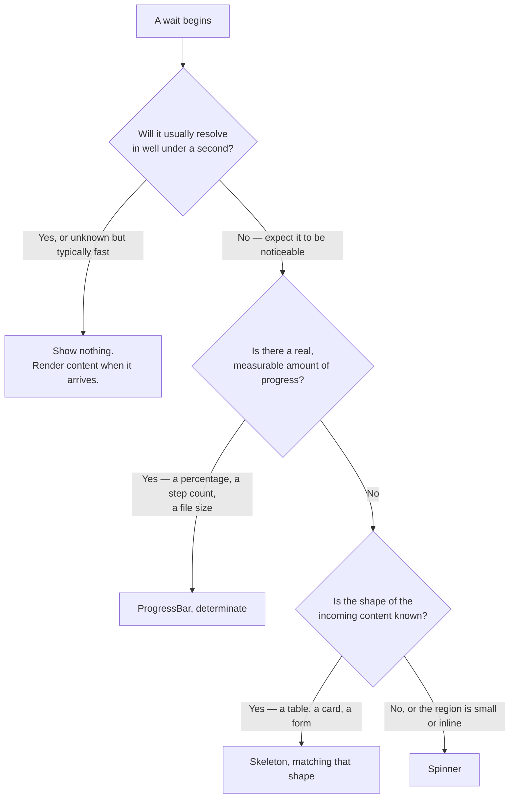

<Warning>
  **First-pass proposal, not established policy.** No audited Invoca screen backs this page —
  Titan's design library was not available while writing it. It is built from general
  interaction-design practice and from what [Skeleton](/invoca-design-system/components/feedback/skeleton),
  [Spinner](/invoca-design-system/components/feedback/spinner), and
  [ProgressBar](/invoca-design-system/components/feedback/progress-bar) already establish.

  It also sits on top of a real, verified finding, not a hypothetical one:
  [TITAN-GAP-31](/invoca-design-system/foundations/open-decisions#titan-gap-31). Skeleton — the
  component this page leans on most — carries **no theme overrides, no tokens, and no
  representation in the design library at all**, despite being the most-used component in this
  area: **132 usages across 13 applications**. This page proposes how to *use* Skeleton
  consistently. It does not, and cannot, resolve what Skeleton *is* — that gap stays open, and
  everything below is a usage layer built on top of an undecided foundation.
</Warning>

## The problem

A page that has nothing to show yet has three honest ways to say so: promise a shape ("here's
roughly what's coming"), promise nothing but activity ("something is happening"), or promise a
measurable amount ("this much is done"). Using the wrong one either misleads the reader about
what's arriving or wastes the one advantage the right one had.

Get the *duration* wrong and the failure is different but just as visible. A loading state that
flashes for 150ms and vanishes reads as a glitch. One that never resolves reads as a hang, and
the reader has no way to tell a slow network from a broken one.

Titan already ships all three primitives — Skeleton, Spinner, ProgressBar — with no decision
about which to reach for when, and evidence that the gap has a real cost: three separate
applications have independently built what appears to be the same `TabLoadingSkeleton`, at 21
instances each. That is not three teams making different choices. It is three teams answering
the same unanswered question on their own.

## Decide first: what do you actually know?



<Tip>
  **Skeleton is not the default just because it is the most-used.** It is correct only when the
  shape is known. Reaching for it when the shape is a guess trades a blank region for a
  confidently wrong one — see [TITAN-SKL-02](/invoca-design-system/components/feedback/skeleton#constraints).
</Tip>

## When this applies

- Content whose eventual layout — line count, widths, roughly how many rows or fields — is
  known before it arrives.
- A wait long enough to notice, and a region large enough that a blank space would read as
  broken rather than loading.

## When it doesn't

| Situation | Do this instead | Why |
|---|---|---|
| The response is usually fast — well under a second | Nothing. Render the content directly. | A loading state that flashes and vanishes costs more attention than the wait it covered. |
| The shape of what's coming is unknown, or the space is small and inline | [Spinner](/invoca-design-system/components/feedback/spinner) | A skeleton is a promise about layout. Guessing at one is worse than promising nothing. |
| A real percentage, step count, or size is available | [ProgressBar](/invoca-design-system/components/feedback/progress-bar) | A skeleton says "wait"; a progress bar says "how much longer" — use the more specific answer when it exists. |
| Content already on screen is being refreshed | The data component's own loading affordance; keep the existing content visible | Replacing readable content with grey shapes takes away what the reader was looking at — [TITAN-SKL-07](/invoca-design-system/components/feedback/skeleton#constraints). |
| The load has failed or timed out | [Error handling](/invoca-design-system/patterns/error-handling) | A loading state is not an error state. This page does not decide timeout or retry behavior — that pattern does. |

## Structure

| Order | Component | Role |
|---|---|---|
| 1 | Loading region (any container) | Carries the "this is loading" state — `aria-busy="true"` — which is what gets announced, not the placeholder inside it |
| 2 | [Skeleton](/invoca-design-system/components/feedback/skeleton) — one instance per line, block, or shape | Matches the width, count, and spacing of the content it stands in for |
| 3 | Minimum-display and timeout guard (behavioral — not a component) | Bounds how briefly and how long the loading state may run before handing off |
| 4 | Resolved state — real content, [EmptyState](/invoca-design-system/components/data-display/empty-state), or [Alert](/invoca-design-system/components/feedback/alert) | What the loading state always ends in. Never itself. |

```
┌─────────────────────────────────────────────┐
│  Campaigns                       [ + New ]   │  ← page chrome; not greyed out
├─────────────────────────────────────────────┤
│  ▓▓▓▓▓▓▓▓▓▓▓▓        ▓▓▓▓▓▓      ▓▓▓▓▓▓▓▓    │
│  ▓▓▓▓▓▓▓▓▓▓          ▓▓▓▓▓▓      ▓▓▓▓▓▓▓▓    │  ← skeleton rows, matching the
│  ▓▓▓▓▓▓▓▓▓▓▓▓▓▓      ▓▓▓▓▓▓      ▓▓▓▓▓▓▓▓    │    real table's column widths
└─────────────────────────────────────────────┘
```

## Behavior

| State | Behavior |
|---|---|
| Wait begins | If expected duration is well under a second, show nothing at all — see [TITAN-LOADING-02](#constraints) |
| Wait exceeds the threshold | Skeleton (shape known), Spinner (shape unknown), or ProgressBar (value known) appears |
| Content arrives | Loading state is replaced; the region announces once that it finished, not that it was loading |
| Content arrives but is empty | Resolves to [EmptyState](/invoca-design-system/components/data-display/empty-state), never to blank space |
| Wait exceeds a timeout | Hand off to [Error handling](/invoca-design-system/patterns/error-handling) — this page does not define the threshold or the retry affordance |
| A refresh of existing content | Existing content stays visible; no skeleton replaces it |

## Constraints

| ID | Constraint | Rationale |
|---|---|---|
| **TITAN-LOADING-01** | Match the indicator to what's known: a real value → ProgressBar; a known content shape → Skeleton; neither → Spinner. | Each primitive communicates a different amount of information. Using the wrong one either overstates what's known or wastes information that was available. See [TITAN-SKL-02](/invoca-design-system/components/feedback/skeleton#constraints). |
| **TITAN-LOADING-02** | Show no loading indicator at all for a wait expected to resolve in under roughly 300ms. | Below that, the indicator itself becomes the most noticeable thing on screen — it appears and disappears faster than the reader can register what it was, which reads as a flicker rather than feedback. |
| **TITAN-LOADING-03** | A skeleton screen matches the real layout — same line count, widths, and spacing as the content it replaces. | Its only value is preparing the reader for a shape. A mismatch makes the page jump on load, which undoes the reason to use one at all — [TITAN-SKL-01](/invoca-design-system/components/feedback/skeleton#constraints). |
| **TITAN-LOADING-04** | One animation, one loading primitive, per region. Do not mix Skeleton's `pulse` with `wave`, or a skeleton with a spinner, in the same view. | Two loading rhythms in one region read as two different systems, not one thing loading — [TITAN-SKL-04](/invoca-design-system/components/feedback/skeleton#constraints). |
| **TITAN-LOADING-05** | A loading state always resolves — to content, an [EmptyState](/invoca-design-system/components/data-display/empty-state), or a handoff to [Error handling](/invoca-design-system/patterns/error-handling). It never simply stops appearing. | An indefinite loading state is a hang the interface is disguising as progress — [TITAN-SKL-03](/invoca-design-system/components/feedback/skeleton#constraints). |
| **TITAN-LOADING-06** | A skeleton screen used on more than one page is built once and shared, not re-implemented per application. | [TITAN-GAP-31](/invoca-design-system/foundations/open-decisions#titan-gap-31) records three independent copies of the same `TabLoadingSkeleton`, 21 instances each. That duplication is the measured cost of not doing this. |
| **TITAN-LOADING-07** | Under `prefers-reduced-motion: reduce`, pass `animation={false}` to every Skeleton on the screen. | The component does not honor the preference itself — [TITAN-SKL-05](/invoca-design-system/components/feedback/skeleton#constraints), [TITAN-GAP-08](/invoca-design-system/foundations/open-decisions#titan-gap-08). This is a call-site workaround, not a fix. |
| **TITAN-LOADING-08** | The loading region carries `aria-busy` and announces completion once; the placeholder itself is hidden from assistive technology. | Grey shapes carry no information to a screen reader. The announcement belongs to the region, and only on completion — [TITAN-SKL-06](/invoca-design-system/components/feedback/skeleton#constraints). |

## Content

| Element | ✅ | ❌ |
|---|---|---|
| Skeleton itself | No text at all | "Loading…" written inside a placeholder shape |
| Completion announcement | "Campaigns loaded" — stated once, when content arrives | Repeated or continuous "Loading, loading, loading" |
| Timeout message | Handed to [Error handling](/invoca-design-system/patterns/error-handling) for the actual copy | Silent indefinite animation with nothing to read |

## Accessibility

**A skeleton is decorative; the region it sits in is not.** Hide skeleton shapes from assistive
technology and put `aria-busy="true"` on the region that's loading. Announce once, when the
content resolves — not the fact that loading started, and not on every render while it's still
in progress. A screen-reader user given a running commentary of "loading" has been told less
than one given a single, timed "done."

**Reduced motion is currently unhandled at the component level.** Skeleton's `pulse` and `wave`
animations do not respond to `prefers-reduced-motion: reduce` — this is part of
[TITAN-GAP-31](/invoca-design-system/foundations/open-decisions#titan-gap-31), and the same gap
[TITAN-GAP-08](/invoca-design-system/foundations/open-decisions#titan-gap-08) records at the
motion-foundation level: seven durations exist and none has a reduced variant. Until the
component handles this itself, pass `animation={false}` at every call site under that
preference — [TITAN-LOADING-07](#constraints).

**A spinner or progress bar needs an explicit accessible name at the call site.** Neither sets
one automatically — pair a Spinner with `aria-describedby` on the region it describes and
`aria-busy` on that region; do the same for a ProgressBar reporting a specific process's state.

## Variations

| Variation | When | Change |
|---|---|---|
| Table skeleton | Loading a list or table | Skeleton rows only — column headers stay, because they're already known |
| Card skeleton | Loading a card or tile grid | `rounded`/`rectangular` shapes matching the card's image, title, and body regions |
| Form skeleton | Loading a form's fields | `text`-shape skeletons at the label and field positions, matching real field geometry |
| Inline refresh | Content already on screen is being refetched | No skeleton. Existing content stays visible; use the data component's own loading affordance instead |

## Anti-patterns

**The flashing skeleton.** Showing a placeholder for a wait that resolves in 150ms turns a fast
response into a visible flicker. The fix is not a faster skeleton — it's not showing one at all
under the threshold in [TITAN-LOADING-02](#constraints).

**The eternal skeleton.** Nothing about Skeleton times out on its own. Without a timeout in the
calling code, a failed or hung request looks identical to "still loading," and the reader waits
far longer than they should before concluding otherwise.

**Two animations in one screen.** One region pulsing while another waves reads as two systems
loading independently, not one page. Titan ships both animations with no decision between them —
pick one and stay consistent within a screen.

**Rebuilding the skeleton screen per application.** The pattern this page exists to prevent has
already happened three times over — see [TITAN-GAP-31](/invoca-design-system/foundations/open-decisions#titan-gap-31).
A composed skeleton screen worth naming is worth sharing.
