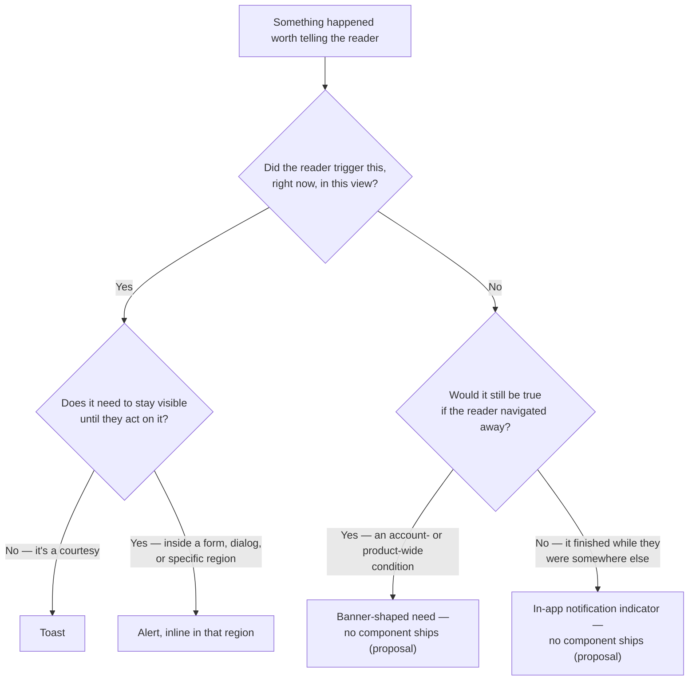

## The problem

Something happens, and the interface has to tell the reader — but "something happened" covers
wildly different situations. The reader just clicked Save and needs a quick confirmation they
can miss without consequence. A campaign's routing has been degraded for an hour and every page
they visit should say so until it's fixed. A field they're editing right now is invalid. An
export they started five minutes ago, before navigating to a different screen entirely, has
just finished.

Titan ships two of the four components this needs — Toast and Alert — with clear jobs and no
shared vocabulary for choosing between them at the composition level. It ships zero for the
third: a persistent, page-independent condition. And it has no answer at all for the fourth:
telling someone about something that finished outside the view they're currently looking at.

Using the wrong surface for the wrong situation has a real cost in both directions. A toast for
a billing problem disappears in five seconds and the reader never sees it again. An alert used
for "your change was saved" becomes furniture nobody reads, sitting in the exact spot where the
next real problem needs to appear.

## Decide first: whose action, and how long does it matter?



## Vocabulary

| Term | Also called | The system uses |
|---|---|---|
| Toast | Snackbar, popup confirmation | **Toast** — a transient, self-dismissing confirmation of the reader's own just-taken action |
| Alert | Inline message | **Alert** — a message anchored to a specific region, form, or dialog, persisting until the condition resolves |
| Banner | Site message, system message | **Banner** — a persistent, account- or product-wide condition. Named in design intent; no component ships — see [Banner](/invoca-design-system/components/feedback/banner). |
| Notification | Alert, message *(used loosely elsewhere)* | Reserved here as the general concept; the specific surface is always named — Toast, Alert, or the unshipped Banner or indicator |

## When this applies

- Deciding which surface tells the reader about an outcome, a standing condition, or something
  that finished outside their current view.

## When it doesn't

| Situation | Do this instead | Why |
|---|---|---|
| Confirming or blocking a destructive action before it happens | [Destructive confirmation](/invoca-design-system/patterns/destructive-confirmation) | That pattern decides whether to interrupt at all; this page only covers reporting an outcome, not gating one. |
| A single field failed validation | [Form validation](/invoca-design-system/patterns/form-validation) | A field-level problem is anchored to the field. A notification surface makes the reader search for which one. |
| The reader must decide something before continuing | [Dialog](/invoca-design-system/components/containment/dialog) | Nothing in this pattern blocks interaction. If the interface must stop the reader, none of these three is the right control. |

## Structure

| Order | Component | Role |
|---|---|---|
| 1 | [TitanToastProvider](/invoca-design-system/components/feedback/toast) | Mounted once near the app root; owns the queue every `showToast` call pushes into |
| 2 | `showToast(message, { variant })` | Called from the triggering action's own success/error handler — never rendered as JSX at the call site |
| 3 | [Alert](/invoca-design-system/components/feedback/alert) | Placed inline, inside the region, form, or dialog the message is about |
| 4 | Banner-shaped composition — **proposal, no component ships** | Would sit in page chrome, above `Contents`, for a condition that outlives the current page |
| 5 | In-app notification indicator — **proposal, no component ships** | Would surface, in page chrome, what happened while the reader was on a different screen |

```
┌───────────────────────────────────────────────────┐
│  Header                                    [🔔 2]  │  ← proposed indicator; not shipped
├───────────────────────────────────────────────────┤
│  Billing on hold — update your payment method       │  ← proposed banner shape; not shipped
├───────────────────────────────────────────────────┤
│  Page content                                       │
│  ┌───────────────────────────────────────────────┐  │
│  │ Campaign could not be saved.        [ Retry ]  │  │  ← Alert, inline in the region
│  └───────────────────────────────────────────────┘  │
└───────────────────────────────────────────────────┘
                                       ┌────────────────┐
                                       │ Campaign saved  │  ← Toast, floats, self-dismisses
                                       └────────────────┘
```

## Behavior

| State | Behavior |
|---|---|
| Toast queued | Appears top-right; stacks up to 3 at once — Toast's own shipped default |
| A 4th toast queues while 3 `persist: true` toasts are showing | The oldest is force-dismissed to make room, per Toast's own queue behavior — not something this pattern adds |
| Alert shown inline | Stays until the reader dismisses it, the underlying condition changes, or the action is retried |
| A Dialog's confirm action fails | The dialog stays open and shows an [Alert](/invoca-design-system/components/feedback/alert) inline — never closes to report failure, the same rule a destructive confirmation follows for its own failures |
| Banner condition resolves (proposal) | Would be removed automatically once the underlying condition clears; a manually-dismissed banner should not reappear until the condition changes again |
| Something finishes outside the reader's current view (proposal) | No toast fires for a view the reader has left. An in-app indicator would increment, and the item would appear in a list when opened |

## Constraints

| ID | Constraint | Rationale |
|---|---|---|
| **TITAN-NOTIFY-01** | Use Toast only for a transient, self-initiated outcome the reader does not need to find again later. | It self-dismisses after 5 seconds by default and leaves nothing behind. |
| **TITAN-NOTIFY-02** | Use Alert for anything anchored to a specific region, form, or dialog that must stay visible until the condition is resolved. | Alert accompanies content and persists by design; it never replaces content, and it never disappears on a timer. |
| **TITAN-NOTIFY-03** | Inside a Dialog, a failure is always shown as an inline Alert. The dialog never closes to report it. | Closing on failure discards the reader's context and leaves them unable to tell whether the action actually happened. |
| **TITAN-NOTIFY-04** | A condition that would still be true if the reader navigated away is a Banner-shaped need, not a Toast or a per-page Alert. No Banner component ships today — treat this as an unmet need, not a solved one. | Toast is per-session and self-dismissing; a page Alert disappears when the reader leaves the page. Neither can carry a condition that outlives the page — see [Banner](/invoca-design-system/components/feedback/banner). |
| **TITAN-NOTIFY-05** | Design around Toast's shipped queue limit — up to 3 concurrent, oldest force-dismissed when full — rather than building a separate queueing scheme. | Toast already defines this behavior; a second queue on top of it produces two different stacking rules on one screen. |
| **TITAN-NOTIFY-06** | A notification about something that finished outside the reader's current context is never a Toast. | The reader is not present to see it, and a toast that fires into an empty view and vanishes has told no one anything. |
| **TITAN-NOTIFY-07** | Several similar outcomes completing close together produce one notification naming the count, not one per item. | A stack of five near-identical toasts is not five pieces of information; it is one, repeated, competing with the queue's own 3-item cap. |
| **TITAN-NOTIFY-08** | Severity is never stated in the copy of a Toast or Alert. The icon and color already carry it. | Restating "Error:" at the start of a message spends the reader's attention on something they already know from the color and icon — see [Alert's content rules](/invoca-design-system/components/feedback/alert#content). |

## Content

| Element | ✅ | ❌ |
|---|---|---|
| Toast | "Campaign saved." | "Success! Your campaign has been successfully saved!" |
| Alert | "Campaign could not be saved. [ Retry ]" | "Error occurred." |
| Cross-context notification (proposal) | "Export ready — 12,400 rows. [ Download ]" | "Something happened." |

## Accessibility

**A toast's 5-second default may not give a screen-reader user enough time to hear a longer
message.** This is not a proposal fix — it's a real, documented limitation of the shipped
component. Pass `persist: true` for anything longer than a short confirmation, per
[Toast's own accessibility notes](/invoca-design-system/components/feedback/toast#accessibility).

**An Alert's live-region role depends on when it appears.** Set `role="alert"` for a message
that must interrupt now, and `role="status"` for one that can wait for a pause — never
`role="alert"` on an alert present at page load, since a live region with content already in it
on load announces nothing.

**An in-app notification indicator (proposal) should announce a changed count politely, not
interrupt.** An unread badge changing from 1 to 2 is not urgent enough to cut off whatever the
reader is doing — `aria-live="polite"` on the count, not `"assertive"`.

## Variations

| Variation | When | Change |
|---|---|---|
| Persistent toast | The message is longer or more consequential than a routine confirmation | `persist: true`; a close button renders; no auto-dismiss |
| Bulk toast | Several similar actions complete close together | One toast states the count, not one toast per item |
| Dialog-scoped Alert | A confirm action fails inside an open Dialog | Alert renders inside the dialog; the dialog never closes on failure |
| Cross-context signal (proposal) | Work finishes after the reader has navigated away from where it started | In-app indicator with an unread count; nothing shipped covers this today |

## Anti-patterns

**A toast for something the reader wasn't there to see.** A background export that finishes
three screens after the reader navigated away fires a toast into an empty view. Nobody reads it,
and the outcome is lost the moment it appears.

**An Alert doing a Toast's job.** A success alert that stays on screen after the reader has
moved on becomes part of the furniture — they stop reading it, and it occupies the exact space
the next real problem needs.

**A home-grown banner per team.** With no shipped Banner, the temptation is to compose one from
Alert's tokens inside a single feature, which produces as many visual treatments for
"account-wide condition" as there are teams that have needed one — the same failure mode already
recorded for skeleton screens, three of which were independently rebuilt the same way.

**Silence for background work.** Shipping nothing for "this finished while you were elsewhere"
is a real answer, but an accidental one — the reader is left to notice a change on their own,
or not notice it at all.

## Known issues

| ID | Kind | What |
|---|---|---|
| [TITAN-GAP-31](/invoca-design-system/foundations/open-decisions#titan-gap-31) | Open decision | Independent, per-application rebuilding of the same missing piece is already a measured cost elsewhere — three applications built the same skeleton component separately. Naming Banner as the same risk before it happens, rather than after, follows the same reasoning. |

## Gaps in the current rules

- What an in-app notification indicator's badge should do once the reader has more unread items
  than a small number can display cleanly — cap it, or show an approximate count.
- Whether a Banner, once built, should be dismissible per-account or per-reader, and whether a
  dismissal should expire.
- Whether Toast's 3-item queue cap should differ for `persist: true` toasts, which don't
  self-clear — a queue full of persistent toasts behaves differently from one cycling every 5
  seconds.

## Why it works this way

**The decision tree asks about the reader's action first, and duration second, because those two
questions are genuinely independent.** A self-triggered outcome can still need to persist (a
form error), and a condition the reader didn't cause can still be short-lived (a background job
finishing). Collapsing them into one axis is how a team ends up reaching for Toast because "it
wasn't the reader's fault," when the real problem is that Toast disappears and this needs to
stay.

**Naming two proposals that have no component, instead of silently working around the gap, is
deliberate.** A Banner improvised from Alert's tokens inside one feature looks like a solved
problem from that team's screen, and creates a fourth divergent treatment the moment a second
team needs the same thing — the same, already-measured cost recorded for exactly this pattern
elsewhere.

## Related

[Toast](/invoca-design-system/components/feedback/toast), [Alert](/invoca-design-system/components/feedback/alert),
and [Banner](/invoca-design-system/components/feedback/banner) — the three surfaces (two shipped,
one not) this pattern chooses between. [Destructive confirmation](/invoca-design-system/patterns/destructive-confirmation),
for a dialog's own failure behavior, which this page follows rather than restates.
[Error handling](/invoca-design-system/patterns/error-handling), for what happens before a
notification fires — deciding whether an action failed at all.

## Status

**First-pass proposal, not established policy.** No audited Invoca screen backs this page —
Titan's design library was not available while writing it. It is built from general
interaction-design practice and from what [Toast](/invoca-design-system/components/feedback/toast),
[Alert](/invoca-design-system/components/feedback/alert), and
[Banner](/invoca-design-system/components/feedback/banner) already establish.

One piece of this page has no component behind it at all: the idea of a lightweight in-app
notification indicator for something that happened while the reader was elsewhere. That is
flagged explicitly below, as a proposal with nothing shipped — not as an existing part of
Titan. Banner itself is also unshipped; its own page documents that as a checked, real
absence, not an unwritten stub.
