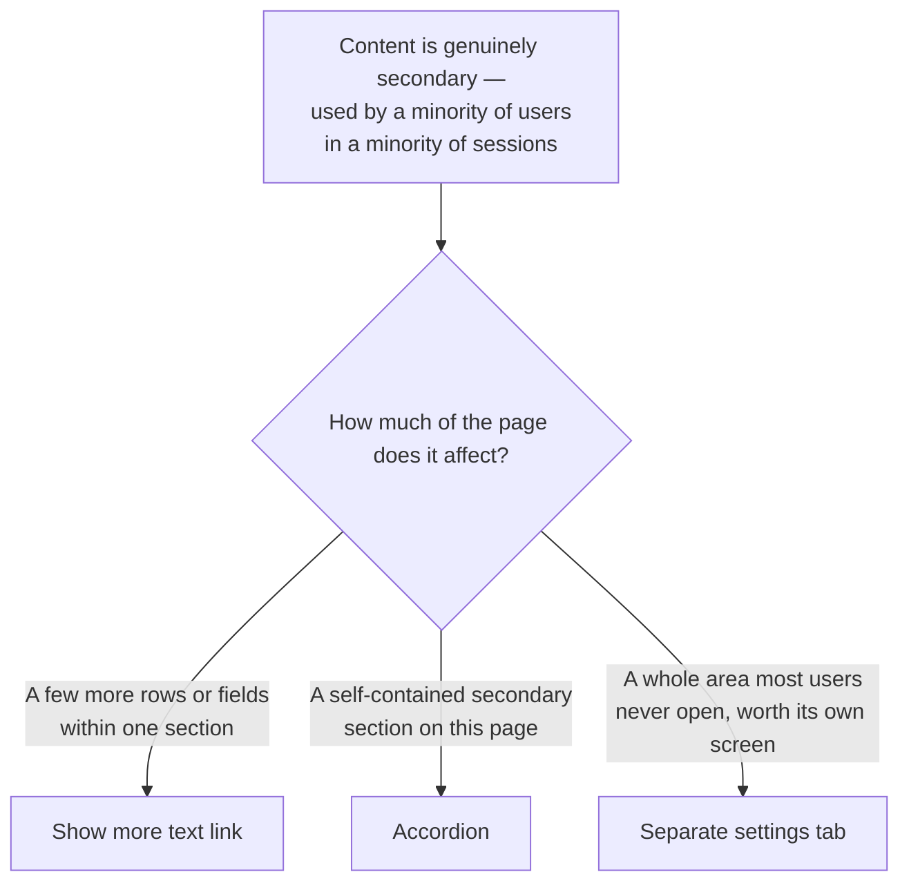

<Warning>
  **First-pass proposal, not established policy.** No audited Invoca screen backs this page —
  Titan's design library was not available while writing it. It is built from general
  interaction-design practice and from what [Accordion](/invoca-design-system/components/containment/accordion)
  already establishes. Treat every threshold below as a starting point to check against real
  product screens, not as a rule already enforced.
</Warning>

## The problem

Every screen accumulates options over time: a filter someone asked for once, an advanced field
that matters for one integration, a setting nine out of ten accounts never touch. Show all of
it and the page a new user opens looks nothing like the task they came to do. Hide too much of
it, or hide the wrong thing, and the interface has quietly removed a control people actually
need — which is worse than cluttering the page, because a hidden-but-needed setting reads as
"not supported" rather than "one click away."

Progressive disclosure is not a single control. It is a decision about scope — how much of the
page is affected by hiding something — made three different ways depending on that scope: a
text link revealing a few more rows of the same list, a collapsible section holding a
self-contained block of secondary content, or an entirely separate area reached by its own
navigation. Treating all three as interchangeable is how a setting that deserved its own tab
ends up buried one click inside an accordion, or a two-field toggle gets promoted to a whole
settings screen nobody needed.

## Decide first: how much of the page is affected?



<Tip>
  **The heuristic is testable, not a vibe.** Before disclosing anything, name who uses it and how
  often: "used by fewer than X% of accounts, in fewer than Y% of their sessions" is a claim
  someone can check against real usage. "This feels advanced" is not.
</Tip>

## When this applies

- The content is genuinely secondary or advanced, by the heuristic above — not merely "would
  make the page shorter."
- Hiding it does not remove the only way to discover that the capability exists at all.

## When it doesn't

| Situation | Do this instead | Why |
|---|---|---|
| The content is the reason the reader is on this page | Show it open, by default | Disclosure adds a click to the exact thing they came to do. |
| A majority of users need the option in a majority of sessions | Show it directly on the page | Hiding a widely-needed control behind an extra click is the failure this pattern exists to prevent, not to cause — see the overview's [Choosing a pattern](/invoca-design-system/patterns/overview#choosing-a-pattern) table. |
| The section holds a validation error that needs to be seen | Open it regardless of the default | See [Form validation](/invoca-design-system/patterns/form-validation) for how an error should surface; this page only decides the collapsed/expanded default, not the validation rule itself. |
| The option is destructive or safety-relevant | [Destructive confirmation](/invoca-design-system/patterns/destructive-confirmation) | Friction on a dangerous action is calibrated to its consequence, not to how often it's used — hiding it behind disclosure is the wrong kind of friction entirely. |

## Structure

| Order | Component | Role |
|---|---|---|
| 1 | Trigger — [AccordionSummary](/invoca-design-system/components/containment/accordion), a text-styled [Button](/invoca-design-system/components/actions/button), or a [Tab](/invoca-design-system/components/navigation/tabs) | Names what's hidden and what opening it does. Never a bare chevron with no label. |
| 2 | Disclosed region — [AccordionDetails](/invoca-design-system/components/containment/accordion), the revealed rows, or the tab panel | Holds the secondary content; collapsed by default unless an exception below applies |
| 3 | Expand indicator | Visual affordance that state can change — required on the Accordion and the text link; implicit on a tab |

```
┌─────────────────────────────────────────┐
│  Routing rules                            │
│  ...primary fields...                     │
│                                            │
│  ▸ Advanced matching options               │  ← Accordion, collapsed by default
├─────────────────────────────────────────┤
│  Recent calls (5 of 42)                   │
│  ...5 rows...                              │
│  Show 37 more ⌄                            │  ← "Show more" text link, states the count
└─────────────────────────────────────────┘
```

## Behavior

| State | Behavior |
|---|---|
| Page loads, no exception applies | Disclosed section starts collapsed |
| Disclosed content is the reason the reader is on this page | Starts expanded |
| Disclosed section contains a validation error | Starts expanded regardless of the default — see [Form validation](/invoca-design-system/patterns/form-validation) |
| Reader expands a section | Opens in place; the page does not scroll or jump |
| Reader collapses a section | Content and any input already entered are retained, not discarded |
| Reader reloads the page or returns in a later session | **Undecided.** No session-persistence rule exists yet for disclosure state — treat each load as collapsed-by-default until this is decided, rather than assuming either answer. |

## Constraints

| ID | Constraint | Rationale |
|---|---|---|
| **TITAN-DISCLOSE-01** | Disclose only content that's genuinely secondary — used by a minority of users in a minority of sessions. | Disclosure is friction with a purpose. Applied to something most users need, it becomes the "hide a needed setting" failure this pattern exists to prevent, not cause. |
| **TITAN-DISCLOSE-02** | Match the scope of disclosure to the scope of the content: a few more rows or fields → "Show more" link; a self-contained section → Accordion; a whole secondary area → a separate settings tab. | The three controls cost the reader differently. Using Accordion for what should be a settings tab hides an entire area one click inside a page that isn't advertised as containing it. |
| **TITAN-DISCLOSE-03** | A disclosed section starts collapsed unless it is the reason the reader is on the page, or it contains a validation error that must be visible. | Collapsed-by-default is the whole point for genuinely secondary content; the two exceptions are cases where the default would actively hide what the reader needs right now. |
| **TITAN-DISCLOSE-04** | The trigger's label names what's inside — never a bare icon or the word "More" alone. | A reader deciding whether to open something needs to know what's behind it before committing the click. |
| **TITAN-DISCLOSE-05** | Each Accordion trigger carries its own `id` and `aria-controls` pointing at its content, wired by hand. | Accordion does not pair these automatically — the only published example does it manually. Omitting it ships a disclosure control with no programmatic link to what it discloses — [TITAN-ACCORDION-01](/invoca-design-system/components/containment/accordion#constraints). |
| **TITAN-DISCLOSE-06** | Collapsing a section never discards content or input already entered inside it. | A reader who fills in an advanced field, collapses the section to check something else, and returns to find it empty has lost work to a UI action that should have been inert. |
| **TITAN-DISCLOSE-07** | A destructive or safety-relevant control is never the thing being hidden by this pattern. | Friction on a dangerous action follows [Destructive confirmation](/invoca-design-system/patterns/destructive-confirmation)'s tiers, which are calibrated to consequence — not to how rarely the control is used. |
| **TITAN-DISCLOSE-08** | Where several Accordions stack, nothing assumes shared "only one open" behavior unless the composition explicitly builds it. | Accordion carries no group state itself — each instance is independent. A caller expecting mutual exclusivity for free will not get it. |

## Content

| Element | ✅ | ❌ |
|---|---|---|
| Accordion trigger | "Advanced matching options" | "More" |
| Show-more link | "Show 37 more" | "Show more" with no count |
| Collapsed section, no error | (nothing extra) | "Click here to expand this section" — narrating the obvious control |

## Accessibility

**A collapsed section is not a hidden one — it is a keyboard- and screen-reader-operable
control that happens to be closed.** The trigger must be reachable by keyboard and must state,
in its accessible name, what it reveals — not "toggle" or "expand," which say nothing about the
content.

**Accordion's own documentation does not confirm that `aria-expanded` is set automatically on
the trigger.** Its accessibility section states only what the underlying elements provide
natively, with no test asserting specific ARIA attributes. Verify this at the call site rather
than assuming the component supplies it — the same caution that produced
[TITAN-DISCLOSE-05](#constraints) for `aria-controls` and `id`.

**A validation error inside a collapsed section must force it open, and must be announced.**
A screen-reader user who submits a form and hears nothing, because the only invalid field is
inside a section that stayed collapsed, has no path to the problem — see
[Form validation](/invoca-design-system/patterns/form-validation).

## Variations

| Variation | When | Change |
|---|---|---|
| Accordion group, one open at a time | Sections are mutually exclusive alternatives, not independent reads | Caller manages shared state explicitly — Accordion provides no grouping behavior of its own |
| "Show more" over Accordion | The hidden content is more of the same list, not a different kind of information | A text link with a count, no header or border framing |
| Settings tab over Accordion | The secondary area is large enough to be worth its own screen | A dedicated tab in the page's tab bar, not a scroll-triggered reveal |
| Disabled trigger | The disclosed content requires a prerequisite the reader hasn't met yet | Accordion's `disabled` prop; the trigger's label states the prerequisite, not just that it's unavailable |

## Anti-patterns

**Disclosure as camouflage for a setting most people need.** Burying a control the majority of
users touch in most sessions behind a collapsed accordion doesn't simplify the page — it moves
the complexity from "visible" to "undiscoverable," which is worse.

**A chevron with no label.** An icon-only trigger asks the reader to open something before
telling them what it is. The label is what lets them decide whether opening it is worth the
click.

**A validation error hidden inside a collapsed section.** A form that reports "something is
wrong" without opening the section containing the actual invalid field sends the reader hunting
through every collapsed area to find it.

**Reinventing "only one open at a time" per screen.** Accordion ships with no group behavior,
so every list of mutually exclusive sections either gets this built fresh or gets left without
it — a smaller version of the same duplication
[TITAN-GAP-31](/invoca-design-system/foundations/open-decisions#titan-gap-31) records for
skeleton screens.
